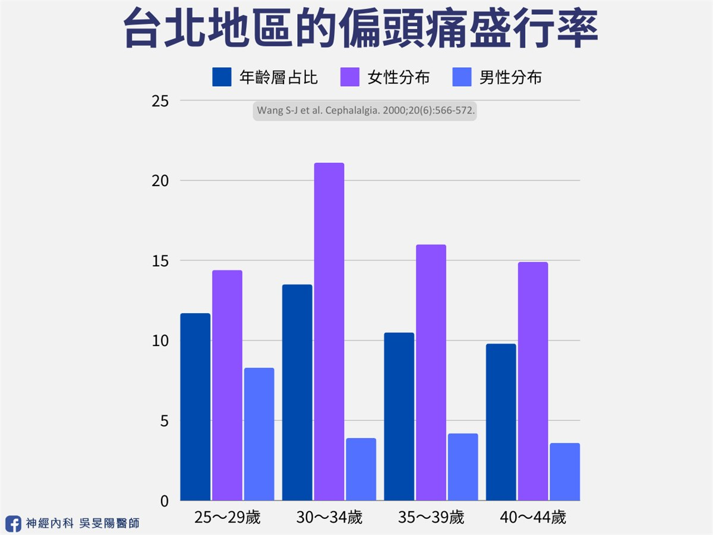
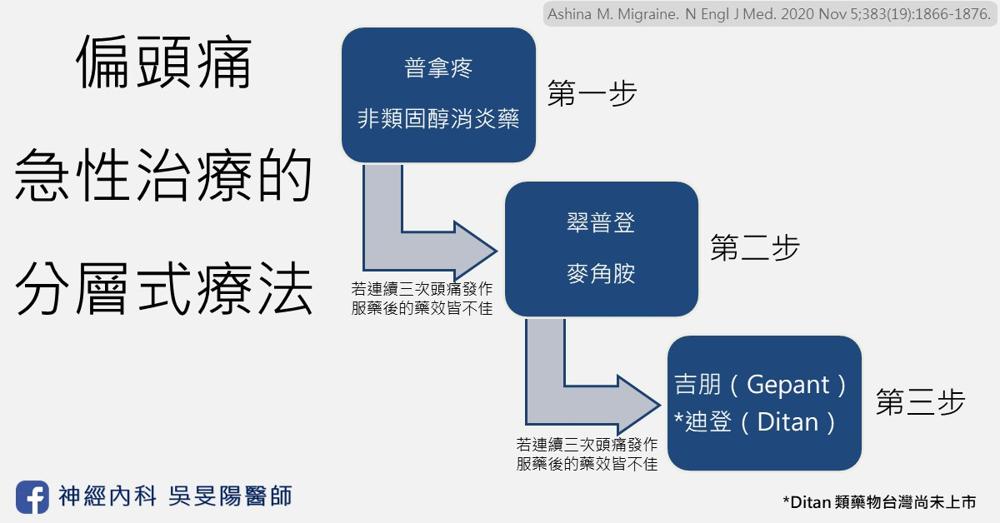

蕭女士是一位 30 多歲左右的職業婦女，身患偏頭痛所擾已經邁入第 10 年。每當工作比較忙碌，或是季節變化的時候，偏頭痛發作的頻率就會提高，甚至是每天發作。頭一痛起來，那感覺就像是有個人拿著錘子一直打我的太陽穴及臉頰，頭就像是快要裂開一樣。怕吵的她都想要趕緊找個安靜的地方躺著。但因工作進度的壓力，只能趕緊先吞止痛藥了事。

只是若遇到藥效不佳的時候，頭痛可能持續兩三天，於是延後下班或是回家熬夜就變成家常便飯，煩躁的心情和失眠狀況更加劇了頭痛，這樣的惡性循環不知道已經重複了幾次。「醫師，為什麼是我？要得這種病呢？」

## 每 10 個台灣人就有 1 人罹患偏頭痛！

像蕭女士這樣子的偏頭痛患者，不定時因為頭痛導致無法工作或是正常生活的人，全球有將近 10 億人，相當於**每平均 7～8 個人之中就會有 1 人**罹患偏頭痛。根據台灣頭痛學會資料指出，台灣地區將近有 200 萬人患有偏頭痛，盛行率約為 9.1%。就算自己並非偏頭痛患者，一定也有聽過身邊的人提過。患者多分布在青壯年族群，正是社會生產力的主要來源。台灣每年因偏頭痛而請假造成的經濟損失達 46 億元。

頂尖醫學期刊 Lancet Neurology 於 2024 年 4 月份刊登的一篇[文章](https://www.ncbi.nlm.nih.gov/pmc/articles/PMC10949203/)指出：

- 造成全世界總人口失能的疾病當中，偏頭痛排名為**第三名**，僅次於腦中風及新生兒腦病變。
- 若考慮年齡層的分布，在 5～19 歲的族群造成失能的疾病當中，**偏頭痛是排名第一**。
- 在 20～59 歲的族群則是偏頭痛**排名第二**，僅次於腦中風。

所幸偏頭痛和腦中風不同最大的差別在於，透過適當的藥物治療，偏頭痛病患可以得到控制，得以回歸正常人的生活以及工作崗位。因此偏頭痛藥物的新藥總會有醫師和病人們的高度關注。

## 偏頭痛有什麼藥物可以吃？

偏頭痛的藥物治療可以分為**兩大類**（可參考[頭痛藥物圖鑑](/posts/migraine-prevention-oral/#頭痛藥物圖鑑)）：急性發作才需要的止痛藥物、以及需要長期固定服用的預防藥物。**急性止痛藥物**患者們幾乎都會需要，它又可分為「專一性」藥物，和「非專一性」藥物。**預防性藥物**一般是以偏頭痛發作的頻率、對病患生活的影響，對急性藥物的反應等等，來決定是否要使用。舉例來說，偏頭痛**平均每週發作超過一天**，或是一個月超過四天，就建議加上預防性藥物。

根據台灣頭痛學會於 2022 年出版的[偏頭痛急性發作治療準則](https://taiwanheadache.org.tw/wp-content/uploads/2022/10/2022-%E5%81%8F%E9%A0%AD%E7%97%9B%E6%80%A5%E6%80%A7%E6%B2%BB%E7%99%82%E6%BA%96%E5%89%87.pdf)，**「專一性」止痛藥物**可分為兩大類：麥角胺類（Ergotamine）與翠普登（Triptan）。**「非專一性」藥物**則有普拿疼（Acetaminophen）、非類固醇消炎藥（NSAIDs）、止吐藥物、複方止痛製劑（一般市售止痛藥，包括日本的 EVE、或是感冒糖漿等等）。

倘若點開國外版本的偏頭痛急性藥物治療建議（如下圖），除了麥角胺及翠普登以外，尚有第三線的急性藥物可以使用，也就是吉朋（**Gepant**）類、以及迪登（**Ditan**）類的藥物。

為了從種類繁多的急性藥物中做選擇，台灣頭痛學會以及美國頭痛醫學會等，都推崇**分層式療法**，也就是透過病人偏頭痛的嚴重程度，工作家庭學業受影響的程度等等去評估。較為輕微的可以先從一般常見的止痛藥開始，較為嚴重的可直接挑選專一性高的止痛藥物。

## 淺談專一性藥物的治療機轉

### 1. 降鈣素基因相關胜肽（Calcitonin gene-related peptide, CGRP）

在這裡要先介紹一下何謂 CGRP（降鈣素基因相關胜肽）。「胜肽」就是蛋白質組成的一部份。「降鈣素基因相關胜肽」在人體內，代表的意義是神經系統中用來傳遞疼痛的訊息。根據研究指出，偏頭痛病患急性發作的時候，CGRP 會從大腦的三叉神經末端釋放出來，CGRP 再與其「受體」結合後，誘導後續一連串的反應，促使腦部**血管擴張**，便會產生疼痛感受；當頭痛改善了，CGRP 的濃度就會下降。

更有[研究](https://pubmed.ncbi.nlm.nih.gov/20820195/)指出，若將外來的 CGRP 注入病患體內，可誘發偏頭痛發作！因此**血液中的 CGRP 的濃度和頭痛發作有正向關係**。

### 2. 它們怎麼止痛？又有什麼副作用？

現今偏頭痛專一性藥物，可透過：

1. **減少 CGRP 的釋放來降低其濃度**
2. **結合血液中的 CGRP** 讓它無法再與受體作用
3. **直接鎖住 CGRP 受體**讓它無法接受 CGRP 的訊息

以上三種方式，皆可抑制疼痛的訊息傳遞，來達成止痛效果。舉例來說，**翠普登**以及**麥角胺類**藥物可以作用在三叉神經末端，以減少 CGRP 的釋放；**[單株抗體](/posts/migraine-prevention-injections/#一精準打擊cgrp-單株抗體針劑)**之艾久維注射液（Ajovy®）可結合血液中的 CGRP；**吉朋（Gepant）**類藥物，則是作用在比較下游的路徑，鎖住 CGRP 受體。

針對副作用的部分，我們上一段落有講到 CGRP 會誘發血管擴張。因為它影響的並不侷限在腦血管，其他器官的血流供應也可能連帶受影響。所以若 CGRP 濃度降低，**可能會導致腦部以外的血管也收縮**，這就會產生出藥物的副作用。例如，麥角胺、翠普登或是單株抗體，在減少 CGRP 的釋放時，也可能會使其他器官的血管收縮。同時患有心血管疾病（例如心肌梗塞、腦中風等等）的偏頭痛患者，使用此藥必須謹慎。

特別的是，根據 2004 年美國的生物學教授的[研究](https://pubmed.ncbi.nlm.nih.gov/15014178/)及 2015 年瑞典藥物學的[研究](https://pubmed.ncbi.nlm.nih.gov/25731075/)，新型口服藥物吉朋（Gepant）目前並**不會有直接導致血管收縮的副作用**。針對上述心血管疾病的偏頭痛患者，理論上使用新型口服藥物吉朋（Gepant）的話，比較不會有血管收縮的疑慮。

## 新型口服藥物 Gepant 有什麼亮點？

2024 年，我陸陸續續了參加幾場有關於偏頭痛新藥的說明會和學術講座。台灣預計在 2024 年引進的藥物一共有兩種，分別如下：

- **[Atogepant（Qualipta®，艾妥達®）](https://blog.drminyangwu.com/2024/10/2024-gepant_28.html#point3)**，台灣的適應症是用作**長期預防**藥物，預計 2024 年底上市。
- **[Rimegepant（Nurtec® ODT，紐舒泰®）](https://blog.drminyangwu.com/2024/11/2024-gepant-rimegepantnurtec.html)**，台灣的適應症是用作**急性止痛**藥物，2024 年已經上市。

誠如上段所說，新型口服藥物較不會直接導致血管收縮，因此對於有心血管疾病病史的偏頭痛患者，是一個相當理想的替代藥物。此外，目前台灣健保尚未給付，皆須自費使用。

2021 年**美國頭痛醫學會**的[偏頭痛臨床治療指南](https://headachejournal.onlinelibrary.wiley.com/doi/10.1111/head.14153)內文中，列舉出考慮開始使用 Gepant（吉朋）藥物的建議：翠普登（Triptan）藥物無法使用的族群，或者是用過了兩種翠普登藥物但效果都不夠好。**然而在 2024 年**，美國頭痛醫學會在 3 月份的**[立場聲明](https://headachejournal.onlinelibrary.wiley.com/doi/10.1111/head.14692)**，將 CGRP 相關藥物（包含 Gepant 吉朋類）在預防性治療上的臨床使用順位，往前拉到第一線！不用先等其他藥物失敗再來考慮。原因包含以下：

- 針對 CGRP 標靶療法是「偏頭痛特異性」療法。
- 多項證據支持它的有效性，以及安全性。
- 避免病人因使用傳統治療療效不佳或是遇到副作用，而中斷治療。
- 對於各類型偏頭痛病患都適合！（從陣發性偏頭痛、慢性偏頭痛、藥物過度使用頭痛、困難治療族群……都有效）

## 下期待續…

感謝您閱讀到最後。下篇文章，我會再針對兩種新藥做簡介整理，包括臨床試驗成效、副作用、兩者比較等等。若有想先知道的讀者，也歡迎在臉書私訊我喔～

## 延伸閱讀

偏頭痛藥物

- [偏頭痛「預防藥治療」攻略：傳統口服藥 (一)](/posts/migraine-prevention-oral/)
- [偏頭痛「預防藥治療」攻略：長效針劑 (二)](/posts/migraine-prevention-injections/)
- [偏頭痛「預防藥治療」攻略：長效針劑比較和選擇 (三)](/posts/migraine-injections-comparison/)
- 偏頭痛預防性治療攻略：新型口服標靶藥物 (四)
  - [偏頭痛標靶藥│2024 新型口服 Gepant 簡介、機轉](/posts/gepant-intro/)
  - [偏頭痛標靶藥│2024 新型口服 Gepant － Atogepant 艾妥達](https://blog.drminyangwu.com/2024/10/2024-gepant_28.html)
  - [偏頭痛標靶藥│2024 新型口服Gepant － Rimegepant 紐舒泰](https://blog.drminyangwu.com/2024/11/2024-gepant-rimegepantnurtec.html)
  - [偏頭痛 2 種標靶藥比較│Atogepant & Rimegepant 服藥頻率、療效、選擇考量](https://blog.drminyangwu.com/2024/12/Gepant-atogepant-Qualipta%20vs%20Rimegepant%20-%20Nurtec%20-%20comparison-oral-%20new%20drug%20-%202024%20%20.html)

## 參考資料

- [偏頭痛藥物治療的新進展](http://www.fma.org.tw/fweb/doc/mgz/28-2/fma28-2-10.pdf)，作者：王嚴鋒 醫師
- [頭痛電子報 第 220 期](https://taiwanheadache.org.tw/wp-content/uploads/2023/04/epaper220.pdf) CGRP 拮抗劑，作者：陳顗旭 醫師
- [頭痛電子報 第 228 期 Gepants](https://taiwanheadache.org.tw/wp-content/uploads/2024/01/%E9%A0%AD%E7%97%9B%E9%9B%BB%E5%AD%90%E5%A0%B1-No228-%E7%99%BC%E5%B8%83-2.pdf)，作者：敖瑀 醫師
- 台北榮民總醫院 偏頭痛衛教手冊
- [2022 台灣頭痛學會年度記者會](https://taiwanheadache.org.tw/2022-%E5%8F%B0%E7%81%A3%E9%A0%AD%E7%97%9B%E5%AD%B8%E6%9C%83%E5%B9%B4%E5%BA%A6%E8%A8%98%E8%80%85%E6%9C%83/)專欄
