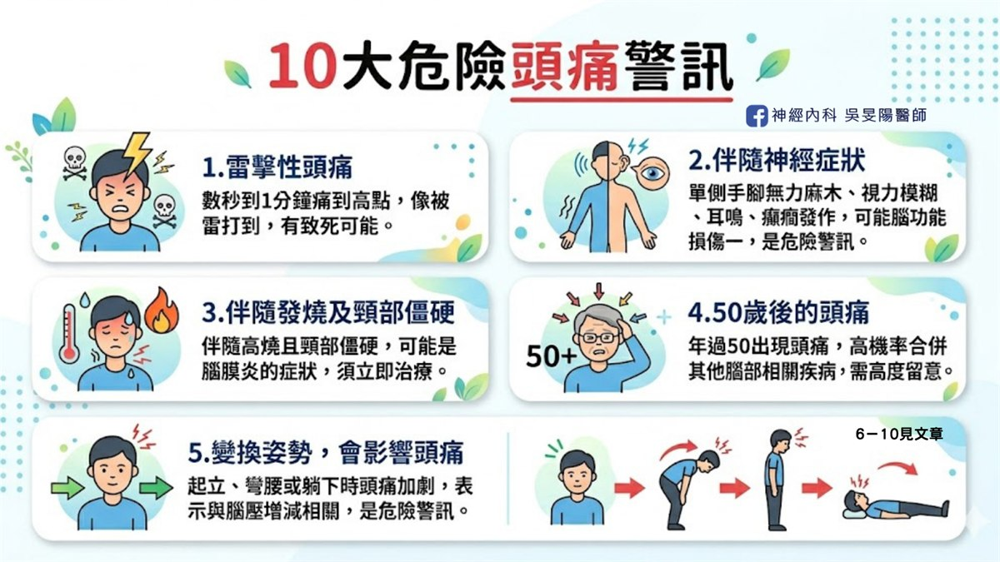
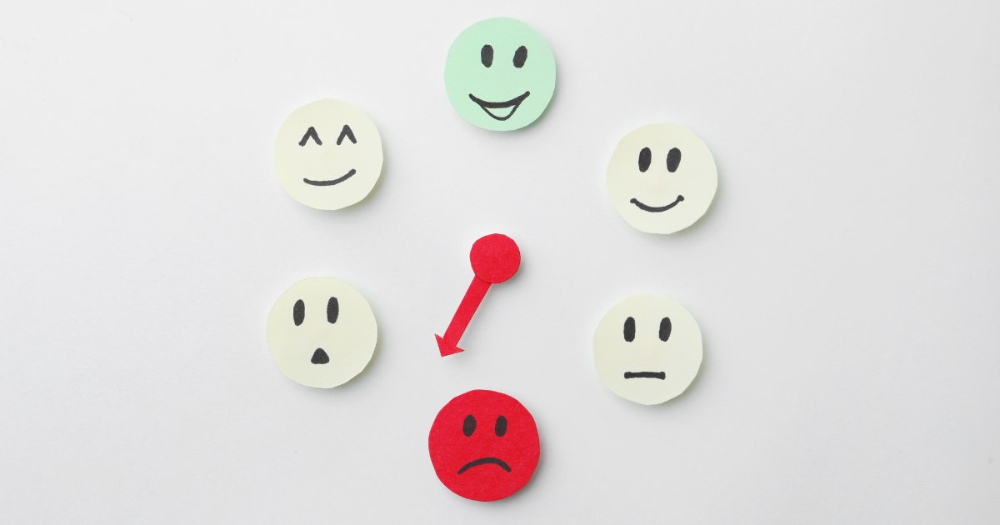
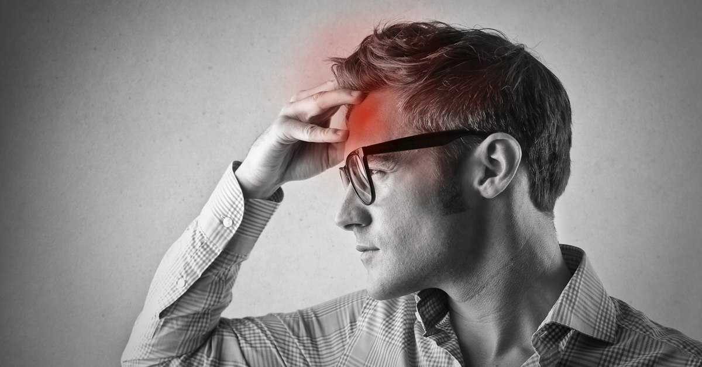

「我只是這幾天睡不好，  
頭比較痛，有需要去看醫生嗎？」

頭痛是幾乎每個人一生都會遇到的問題，現今止痛藥隨處可見，相當便利。然而，有些頭痛特徵或伴隨症狀，背後可能是潛在的嚴重疾病所致。因此，若你的頭痛伴隨以下 10 大危險警訊，建議掛號神經內科醫師～

## 10 大危險頭痛警訊

### 1. 雷擊型頭痛

雷擊型頭痛，是一種**發作突然且劇烈的頭痛**，是高度警訊的危險，**一般建議立即就醫**。可能與腦血管有關，如腦出血、腦血管瘤等情況， 典型的症狀表現：頭痛在非常短時間內，直接痛到最高點(約為幾秒～1 分鐘)，感受像是「爆炸型頭痛、被閃電擊中腦袋的感覺」。

### 2. 伴隨神經症狀

神經症狀和背後病因很多，可以從症狀發展的時間長短來分類，若是突然發作的，可能和腦血管的問題有關聯（腦出血、腦中風）；若症狀持續了數個月，有可能是腦部腫瘤。

- **肢體功能異常**：單側手腳無力、肢體麻木或癱瘓、口齒不清、臉歪嘴斜、走路不穩
- **視力功能改變**：視力模糊、複視(重疊影像)、視野增減
- **意識變差、持續噁心嘔吐、搏動性耳鳴、癲癇發作**

### 3. 伴隨發燒

伴隨發燒現象，又有頸部僵硬、皮疹，或是精神不好、一直昏睡，通常擔心是**腦膜炎**的問題，建議**盡快就醫**！腦膜炎診斷耗時，需接受詳細腰椎穿刺的檢查，以及臨床評估才能進一步確診，診斷與治療都相當棘手，因此不可不慎！

### 4. 50 歲後的頭痛

過往沒有頭痛困擾，卻在中年 50 歲後出現頭痛，就需要特別留意！人到中老年過後，腦腫瘤、腦血管發炎、腦中風等等疾病，發生機率會提高，所以如果這年齡發生頭痛，通常隱藏更多原因。正常來說，中老年過後，偏頭痛機率會下降。

### 5. 變換姿勢，會影響頭痛程度

在起立、彎腰或躺下時頭痛加重，這表示頭痛和腦壓增減有關。

- **高腦壓**：腦部有血塊或塞住、腦部感染、腦腫瘤、水腦症或跟新陳代謝有關問題，少數的處方藥也可能使腦壓提高。感受會是「睡越久頭越痛、睡到半夜痛醒、坐起來，頭痛就會好」。
- **低腦壓**：往往是因近期有做腰椎穿刺、脊椎手術或頭頸部的外傷等等，導致脊髓外膜有破洞缺損，腦水滲漏溢出使得水壓降低、腦壓降低，就可能導致頭痛。低腦壓頭痛也常伴隨著頸部疼痛、耳鳴、聽力改變等症狀，感受「我躺下來頭痛就改善、躺著比較舒服，因為我一下床就開始頭痛」

▲典型的低腦壓頭痛，平躺休息後，約 3 ～ 5 分鐘內就改善，一般的偶發性頭痛，須躺床休息一陣子才會改善，不算是低腦壓頭痛！

### 6. 懷孕中/產後頭痛

懷孕中/產後的媽媽們，由於身體代謝與賀爾蒙的變化，發生新的頭痛，可能會與腦中風、腦部靜脈栓塞有所關連。此外，如果有高血壓或蛋白尿，便可能是子癲前症的問題。子癲前症在台灣發生率約為 2 ~ 8％，發生率不高，但發病後對於胎兒和母親都不利影響，建議找神經科或是婦產科評估喔！

### 7. 有慢性病史(癌症、免疫力低下)

癌症病患若出現新的頭痛，往往會擔心是否有新的腦部轉移，因此建議接受醫師評估。在免疫力低下的族群，如[人類免疫缺乏病毒](https://www.cdc.gov.tw/Category/Page/lehLY2EFku4q7Gqv4bql2w)患者，由於身體抵抗力不佳，腦部感染的機率也比一般人高，包括[結核性腦膜炎](https://www.cdc.gov.tw/File/Get/ab3a8ZioXfrNolFloAN91Q)、病毒性腦膜炎、[隱球菌腦膜炎](https://www.cdc.gov.tw/Uploads/archives/e8d925eb-f9fb-46b4-a954-06d0c75acdfa.pdf)、[弓形蟲病](https://www.cdc.gov.tw/File/Get/Km0yBzY_ockYVS1cyT665w)等等。

### 8. 用力的動作，會影響頭痛

頭痛的嚴重程度，會因用力的日常動作，如：咳嗽、打噴嚏、搬重物、重訓、跑步運動、大便的當下，變得更痛，就需要小心！因為可能是顱內結構性異常，如後顱窩的壓迫、腫塊或感染所致。這些需要憋氣用力的動作，正式術語稱為 **Valsalva maneuver**。

### 9. 頭痛方式和以前不同

原本的頭痛模式突然改變，如：頻率、嚴重度或是持續時間大幅增加、之前是悶痛但變成抽痛、頭痛改變位置等等，可能是腦部有新的變化，建議就醫評估。

### 10. 止痛藥越吃越重，頭痛無改善

一般來說，頭痛越來越嚴重，就需就醫，更要留意是否有**藥物過度使用頭痛**。長期過度使用止痛藥，反而導致頭痛的頻率和嚴重程度增加，最終演變為惡性循環，每日照三餐吃止痛藥，卻仍有頭痛，不吃也痛。

▲ 每週 2 ~ 3 天以上服用止痛藥，便可能有藥物過度使用頭痛的問題。

藥物過度使用頭痛，詳細文章請點：[市售止痛藥，為何吃越多越沒效？認識藥物過度使用頭痛](/posts/medication-overuse-headache/)

## 結語

頭痛相關的危險警訊非常多，以上為常見的 10 大警訊，**有出現以上症狀的你，皆需就醫評估**，有任何疑慮或以上沒列舉出來的，也建議及早看醫。早期發現和治療，可防止更嚴重的後果，確保你的身體健康。

## 延伸閱讀

**頭痛入門必讀**

- [頭痛看診前必讀，醫生會問我什麼問題？](/posts/headache-visit-questions/)

**頭痛地圖：痛哪裡找哪裡**

- [頭痛位置與病因的深度解析：頭痛地圖指南 (上)](/posts/headache-map-part1/)
- [頭痛位置與病因的深度解析：頭痛地圖指南 (下)](/posts/headache-map-part2/)

**偏頭痛病友請進**

- [市售止痛藥，為何吃越多越沒效？認識藥物過度使用頭痛](/posts/medication-overuse-headache/)
- [爆炸型頭痛的隱形殺手 – 小心「可逆性腦血管收縮症候群」！](https://blog.drminyangwu.com/2025/05/thunderclap-headache-Reversible-Cerebral-Vasoconstriction-Syndrome%20%20.html)
- [吃冰會頭痛，也是一種病 – 什麼是「冰淇淋頭痛」？](https://blog.drminyangwu.com/2025/11/headachecold-stimulus-headache-brain-freeze-ice-cream.html)
