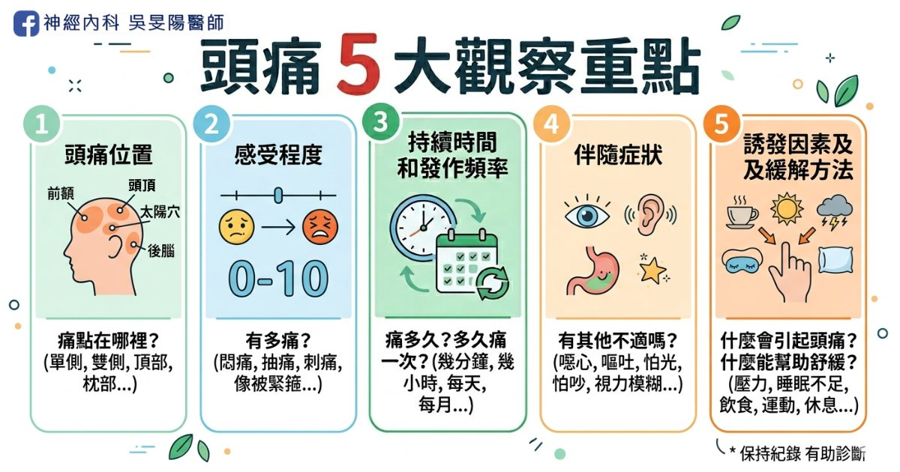
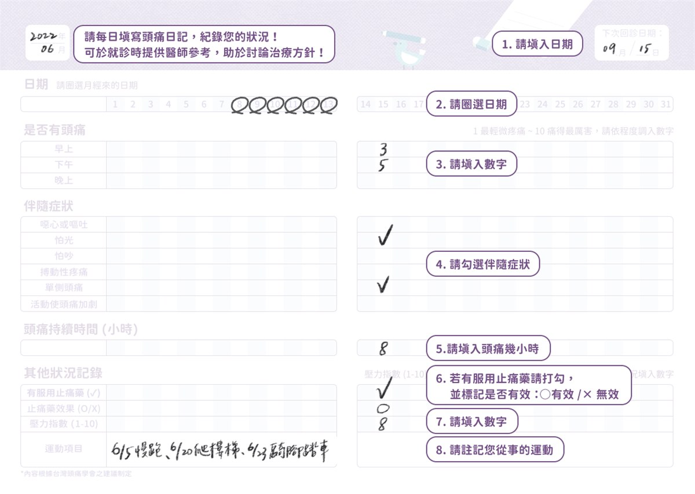
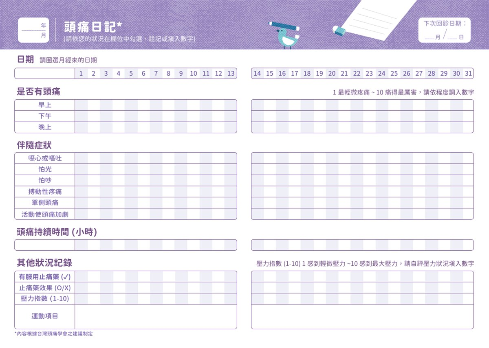

在神經科的門診，頭痛就醫者不在少數，若要具體地描述頭痛的細節，可不是件容易的事情！在看診前，先問問自己以下問題集，幫助醫生快速掌握你的狀況、準確診斷病因，並更有時間討論下一步的治療方向喔！

## 頭痛 5 大觀察重點

### 1. 頭痛位置

- **部位**：單側(右邊 or 左邊)、雙側、整個頭
- **具體位置**：額頭、太陽穴、後腦勺

▲若頭痛不止一次，可留意每次痛的位置是否不同，或有固定區域。

頭痛位置與原因的關聯，詳細文章：

- [頭痛地圖指南 (上) 原發性頭痛](/posts/headache-map-part1/)
- [頭痛地圖指南 (下) 次發性頭痛](/posts/headache-map-part2/)

### 2. 感受程度

- **感受**：痛的感覺如何？(悶痛、脹痛、抽痛、刺痛、像被金箍圈套住的緊縮性疼痛、或有東西在跳的搏動性疼痛)
- **程度**：以 0 到 10 分來評估頭痛程度，0 分是完全不痛，10 分代表最痛的程度。
  - 未吃止痛藥幾分？吃藥後改善到幾分？
  - 是否影響生活或工作、是否需請假、或工作效率變差

### 3. 持續時間和發作頻率

- **持續時間**：每次頭痛都痛多久？(幾秒、幾分鐘、幾小時或整天)
- **發作頻率**：頭痛多久發作、次數(每天、每週、每月發作幾次？)

▲這些數字資訊都是非常重要，尤其發作頻率，更決定要開什麼藥物給你！

更多偏頭痛藥物治療介紹，詳細文章：

- [偏頭痛「預防藥治療」攻略：傳統口服藥 (一)](/posts/migraine-prevention-oral/)
- [偏頭痛「預防藥治療」攻略：長效針劑 (二)](https://blog.drminyangwu.com/2026/03/migraine-prevention-part2-injections-cgrp-ajovy-emgality-botox.html)
- [偏頭痛「預防藥治療」攻略：長效針劑比較和選擇 (三)](https://blog.drminyangwu.com/2026/03/migraine-injections-comparison-cgrp-vs-botox-how-to-choose-cost-and-decision-guide.html)

### 4. 伴隨症狀

- **伴隨症狀**：發作時，是否有噁心、嘔吐、怕光、怕吵、流眼淚、流鼻水、眼睛變紅腫、視力模糊、複視、異常亮點？
- **危險警訊**：是否突然劇烈頭痛(雷擊性頭痛)，或伴隨發燒、脖子僵硬、手腳無力麻木

頭痛的 10 大危險警訊，詳細文章請點：[10 大危險頭痛警訊！哪些情況需要看醫生，一次告訴你](/posts/headache-red-flags/)

### 5. 誘發因素及緩解方法

- **誘發因素**：是否吃了特定食物(巧克力、起司、咖啡)、正在做什麼活動(運動、上班、睡覺、經期)
- **緩解方法**：舒緩方式(平躺、休息、按摩、喝水)

飲食與偏頭痛的關連，有興趣請參考：[改善偏頭痛，該吃什麼呢？加分飲食 vs 地雷食物清單](https://blog.drminyangwu.com/2026/05/migraine-diet-recommendations-food-triggers.html)

## 過去病史、就醫史及家族史

- **過去病史**：是否有慢性病、曾動過手術、頭部外傷？
- **就醫史**：是否曾接受過頭痛相關檢查(影像檢查 or 抽血檢驗)
- **家族史**：家中成員是否也有頭痛問題

▲有接受過相關檢查者，建議攜帶影像光碟、或過去就醫紀錄、處方籤，提供給醫師參考。

## 用藥紀錄及療效

- **用藥紀錄**：目前服用的藥物、劑量、服用頻率？(含處方藥、非處方藥、保健食品、中草藥)
- **療效**：吃藥反應為何？頻率或疼痛程度降低
- **副作用**：是否有過敏反應

## 生活習慣

- **飲食運動**：日常三餐是否規律、作息是否正常、有無喝咖啡的習慣、有無運動習慣。
- **睡眠狀況**：是否有失眠、睡眠不足、或其他睡眠問題。
- **壓力心理**：是否有壓力過大、焦慮或憂鬱的情況。與身心科相關的症狀，常常會和偏頭痛一起出現！

截自 台灣頭痛學會網站之 [頭痛日記與評估量表](https://taiwanheadache.org.tw/wp-content/uploads/2022/09/%E9%A0%AD%E7%97%9B%E6%97%A5%E8%A8%98_2022.pdf)

## 頭痛病友小幫手│頭痛日記

好好紀錄頭痛日記，有 2 個好處：

- **準確診斷治療**：常遇過病人說自己痛 2～3 天/月，實際記錄才發現每月都痛 10 幾天！偏頭痛的藥物治療，將取決於你的頭痛頻率，因此準確記錄是十分重要的。
- **經濟考量**：健保無法給付便要自費，如能申請健保，將可省下一筆醫藥費。頭痛日記，會是必要的審核文件之一。

▲未來也更利於健保申請通過長效針劑：以肉毒桿菌試算，單次價格約 1.5 ~ 2 萬，每 3 個月施打一次，一年費用約 6 ~ 8 萬；單株抗體又更貴，一年約為 12 萬。

長效針劑詳細介紹，請點：[偏頭痛「預防藥治療」攻略：長效針劑 (二)](https://blog.drminyangwu.com/2026/03/migraine-prevention-part2-injections-cgrp-ajovy-emgality-botox.html)

門診掛號可索取紙本，電子檔[頭痛日記電子檔](https://taiwanheadache.org.tw/headache-diary-and-assessment-scale/)

截自 台灣頭痛學會網站之 [頭痛日記與評估量表](https://taiwanheadache.org.tw/wp-content/uploads/2022/09/%E9%A0%AD%E7%97%9B%E6%97%A5%E8%A8%98_2022.pdf)

## 結語

頭痛看診前的準備工作也是不少！包含詳細的頭痛頻率、病史紀錄和用藥記錄，也需留意 10 大危險警訊，以上資料能幫助神經科醫師更有效地診斷與治療，你也更了解自己的身體健康。

## 延伸閱讀

**頭痛入門必讀**

- [10 大危險頭痛警訊！哪些情況需要看醫生，一次告訴你](/posts/headache-red-flags/)

**頭痛地圖：痛哪裡找哪裡**

- [頭痛位置與病因的深度解析：頭痛地圖指南 (上)](/posts/headache-map-part1/)
- [頭痛位置與病因的深度解析：頭痛地圖指南 (下)](/posts/headache-map-part2/)

**偏頭痛病友請進**

- [市售止痛藥，為何吃越多越沒效？認識藥物過度使用頭痛](/posts/medication-overuse-headache/)
- [爆炸型頭痛的隱形殺手 – 小心「可逆性腦血管收縮症候群」！](https://blog.drminyangwu.com/2025/05/thunderclap-headache-Reversible-Cerebral-Vasoconstriction-Syndrome%20%20.html)
- [吃冰會頭痛，也是一種病 – 什麼是「冰淇淋頭痛」？](https://blog.drminyangwu.com/2025/11/headachecold-stimulus-headache-brain-freeze-ice-cream.html)

## 參考資料

- [偏頭痛就醫前應準備哪些資料？](https://taiwanheadache.org.tw/outpatient-notice/%E5%81%8F%E9%A0%AD%E7%97%9B%E5%B0%B1%E9%86%AB%E5%89%8D%E6%87%89%E6%BA%96%E5%82%99%E9%82%A3%E4%BA%9B%E8%B3%87%E6%96%99%EF%BC%9F/)（台灣頭痛學會）
- [頭痛日記與評估量表](https://taiwanheadache.org.tw/headache-diary-and-assessment-scale/)（台灣頭痛學會網站提供）
