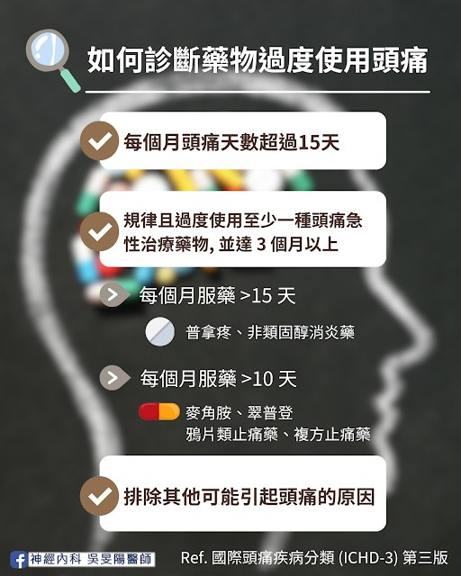
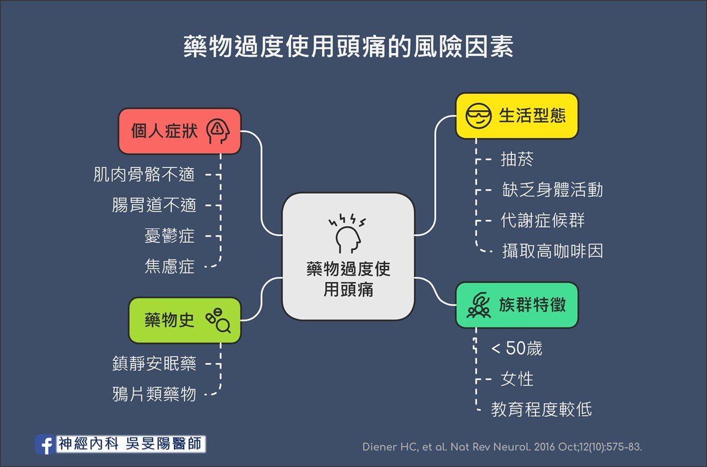
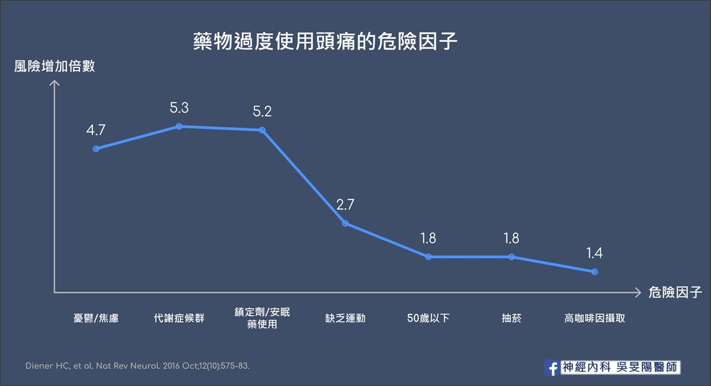

「我工作好忙，看醫生也只是拿止痛藥，不如藥局直接買」

「市售的止痛藥很方便，我都固定補貨慢慢吃」

40 多歲張女士，是位慢性偏頭痛患者，過去數年多來，吃過普拿疼加強錠，斯斯解痛錠、大正百保能，甚至還購買日本 EVE 來吃，舉凡市面上的止痛藥，都吃過好幾輪。

然而，隨著時間過去，市售止痛藥的效果似乎開始變差，吃 1 顆不夠止痛，便自己加到 2 顆，後來效果逐漸變差，頭痛天數也增加，變成天天痛，每天照三餐吃止痛藥，最後痛到連藥丸都吞不下去，要專程跑醫院打止痛針才有效。

「**為何越吃越沒效，頭痛更嚴重？**」

## 甜蜜背後隱藏的危機

現代止痛藥取得容易，效果快又有效。除了頭痛患者，其他慢性疼痛病友（例如下背痛、肩頸疼痛患者），也常是這類疾病的受害者。 他們試過的止痛藥，從西藥、漢醫，或是民間偏方可能都試過一輪。

以頭痛來說，止痛藥剛開始有效，到後來逐漸無效，甚至導致更嚴重的頭痛。於是只好吃更多、吃更重、吃更強的藥，永遠沒有盡頭，陷入了惡性循環。最後有沒有吃止痛藥都會痛起來。

如果有這樣的情形，小心是否患上了「**藥物過度使用頭痛（Medication Overuse Headache）**」、也有人稱為「反彈性頭痛（Rebound headache）」。

藥物過度使用頭痛在一般人口的盛行率約為 1～2%，換句話說，光是在台灣，約有兩百多萬人罹患此病，其中慢性頭痛患者中更是高達 50%！平均年齡為 40～45 歲。大致上也和[偏頭痛盛行的年齡](https://blog.drminyangwu.com/2024/10/2024-gepant.html#point0)相符。

## 如何診斷藥物過度使用頭痛？

根據[國際頭痛疾病分類（ICHD-3）](https://ichd-3.org/wp-content/uploads/2019/11/ICHD-3_Taiwan-version_Mandarin_Traditional-Chinese.pdf)，定義為：

1. **每個月頭痛天數超過 15 天**  
   （等於平均一個月有一半以上的時間都會痛）
2. **規律且過度使用至少一種頭痛急性治療藥物，並達 3 個月以上**  
   診斷條件根據止痛藥的種類有所不同，詳述如下：
   - 若是普拿疼（Acetaminophen）、非類固醇消炎藥（NSAIDs）等等，**每個月服藥天數超過 15 天以上**
     - 常用品項有伊普/布洛芬、服他寧/克他服寧、能百鎮/萘普生
   - 若是麥角胺（Ergotamine）、翠普登（Triptan）、鴉片類止痛藥 （Opioid）、複方止痛藥 (combination-analgesic)，**每個月服藥天數超過 10 天以上**
     - 翠普登類的藥物，常用品項有英明格與羅莎疼
     - 麥角胺類的藥物，常用品項有樂息痛、易克痛
     - 鴉片類止痛藥：可待因（Codeine）
     - 複方止痛藥（含咖啡因）：普拿疼加強錠、斯斯解痛錠、大正百保能解痛加強錠、力疼停加強錠、明通治痛丹散、日本的 EVE 等等
3. **排除其他可能引起頭痛的原因**

簡單來說，一旦每週吃止痛藥超過 2 天，藥物過度使用頭痛就有可能找上門！而且**止痛效果越強的藥物越容易成癮**！

- 根據[德國研究](https://pubmed.ncbi.nlm.nih.gov/12370454/)指出，**翠普登**（平均使用 1.7 年後）和**麥角胺**（平均使用 2.7 年後）類藥物是較快導致藥物過度使用頭痛的品項。

## 哪些是藥物過度使用頭痛的風險族群？

根據於 2016 年德國發表的[文獻](https://pubmed.ncbi.nlm.nih.gov/27615418/)指出，藥物過度使用頭痛之**危險因子**，以各層面來說明的話，包括如下：

### 1. 族群分布

- 50 歲以下
- 女性
- 教育程度較低

### 2. 個人症狀

- 長期肌肉骨骼不適者
- 腸胃道不適者
- 憂鬱症患者 （可參考偏頭痛[失能危機](https://blog.drminyangwu.com/2025/02/migraine-disability-cost-anxiety-.html#point0)）
- 焦慮症患者

### 3. 生活型態

- 抽菸
- 缺乏身體活動（physical inactivity）
- [代謝症候群](https://www.hpa.gov.tw/pages/list.aspx?nodeid=221)（即為三高患者或是肥胖族群）
- 攝取較高咖啡因者（咖啡因 **>540**mg）
  - 以 7-11 販售飲品來比喻的話，一杯特大杯美式就含有近 500mg 的咖啡因；一杯大杯卡布奇諾則是約 300mg 的咖啡因。
  - 因此若習慣每天都喝上兩杯大杯的小 7 咖啡，再加上原本也有慢性頭痛問題，時間一久就可能罹患藥物過度使用頭痛！

### 4. 藥物史

- 鎮靜安眠藥
- 鴉片類藥物（Opioids）

從上面的圖表可以知道，**最容易**演變為藥物過度使用頭痛的危險因子為：

- **憂鬱症、焦慮症患者** （增加 **4.7 倍**的風險）
- **代謝症候群**（增加 **5.3 倍**的風險）
- **使用鎮定劑、安眠藥的人**（增加 **5.2 倍**的風險）

其餘較為次要的危險因子，列舉如下：

- **缺乏身體活動** （增加**2.7 倍**的風險）
- **50 歲以下**（增加**1.8 倍**的風險）
- **抽菸**（增加**1.8 倍**的風險）
- **攝取較高咖啡因**（增加**1.4 倍**的風險）

## 止痛藥是救星還是詛咒？淺談背後成因

坦白說，確切病生理機轉目前仍不明確，但目前多項假設已被提出，包括心理機制、內分泌改變以及神經生理的改變。

### 1. 中樞神經系統敏感化
反覆使用止痛藥對週邊神經系統的刺激可能導致後續中樞神經系統的連鎖反應大腦對疼痛的敏感度增加，即使輕微的刺激也可能引發頭痛。

### 2. 藥物依賴性
大腦對止痛藥產生依賴，類似強迫症，病人無法控制其使用藥物的行為。一旦停止用藥，就會出現戒斷症狀，包括頭痛。

### 3. 神經傳導物質變化
長期用藥可能影響大腦內神經傳導物質的平衡，進而引發頭痛。

### 4. 腦部結構功能改變
研究顯示，受試者在停用急性止痛藥後，他們的腦部影像檢查結果與停藥前有所差別。雙側視丘、前扣帶迴、紋狀體以及右下頂葉的葡萄糖代謝率較低，而在停藥治療後會恢復正常。

## 小心！這可能是止痛藥過度使用的警訊！

所有慢性疼痛患者，除了審視自己服用止痛藥的頻率之外，以下幾點也可幫助自我檢測：

- 頭痛頻率增加、程度加劇
- 幾乎每天或每天都需要吃止痛藥
- 規律使用急性頭痛藥物超過 3 個月
- 對原本有效的止痛藥反應變差
- 即使疼痛不嚴重也想吃止痛藥，若沒有吃就會感到不安或焦慮

如果您發現自己符合上述多項警訊，建議儘早諮詢神經內科醫師，以進行更詳細的評估和診斷，並擬定適當的治療策略。及早介入治療對於戒斷止痛藥非常重要～

## 要怎麼治療？– 擺脫止痛藥依賴，告別頭痛惡性循環

### 1. 限制止痛藥使用

停止過度使用藥物，才能真正改善頭痛，這也是重要的第一步。研究指引建議，停用原來服用的急性止痛藥**至少一週左右的時間**；但若為鴉片類或是鎮靜類藥物，突然停藥的話可能導致嚴重的戒斷症狀，建議先諮詢醫師，評估是否逐步減量。

但這不容易達成，就好比要求一個老菸槍突然戒菸一樣。初期停用止痛藥期間，尤其是第一週內，病人會出現許多戒斷症狀，例如頭痛程度增加、心跳加快、睡眠障礙、焦慮、緊張等生理反應。因此往往需要搭配**過渡期療法**。

### 2. 過渡期療法（Bridge Therapy）

為了減少初期的戒斷症狀，導致治療失敗。若為嚴重的藥物成癮，一般會**建議住院**調藥，透過靜脈點滴或是打針的方式幫助戒除藥物過度使用頭痛。

過渡期療法包括：提供**不同藥理機制**的止痛藥 、神經阻斷術 （Nerve block）、類固醇。此外，止吐針劑、抗癲癇藥物、或是鎂離子注射也能提供療效。

### 3. 加上預防性藥物

目前有明確人體試驗支持對藥物過度使用頭痛有效的預防藥物包括：

- [傳統口服預防藥物](/posts/migraine-prevention-oral/)：妥泰（Topiramate）、或者其他心血管藥物、抗癲癇用藥、抗憂鬱劑
- [新型長效針劑](https://blog.drminyangwu.com/2026/03/migraine-injections-comparison-cgrp-vs-botox-how-to-choose-cost-and-decision-guide.html)：[肉毒桿菌注射](https://blog.drminyangwu.com/2026/03/migraine-prevention-part2-injections-cgrp-ajovy-emgality-botox.html#point4)，以及針劑劑型的 [CGRP 單株抗體](https://blog.drminyangwu.com/2026/03/migraine-prevention-part2-injections-cgrp-ajovy-emgality-botox.html#point3)
- [新型口服標靶](https://blog.drminyangwu.com/2024/10/2024-gepant.html)：Gepant 藥物 [Atogepant（艾妥達）](https://blog.drminyangwu.com/2024/10/2024-gepant_28.html)。

### 4. 嘗試非藥物性的頭痛緩解方法

- 規律作息、充足睡眠
- 適度運動、放鬆身心
- [頭痛日記](/posts/headache-visit-questions/#頭痛病友小幫手頭痛日記)，使用日記記錄頭痛天數和止痛藥使用天數，有助於追蹤病情和評估治療效果。更重要的是，頭痛日記寫得好，也能[幫自己省錢](https://blog.drminyangwu.com/2026/03/migraine-injections-comparison-cgrp-vs-botox-how-to-choose-cost-and-decision-guide.html#point0)！

相較之下，美國的一篇大型[臨床試驗](https://pubmed.ncbi.nlm.nih.gov/38659334/)顯示，[偏頭痛新型口服 CGRP](https://blog.drminyangwu.com/2024/10/2024-gepant.html) 受體拮抗劑當中，[Rimegepant（紐舒泰）](https://blog.drminyangwu.com/2024/11/2024-gepant-rimegepantnurtec.html)和 Ubrogepant 用於急性偏頭痛發作時，**不會增加**併發藥物過度使用頭痛的風險。其他細節亦可參考我之前寫過的[文章](https://blog.drminyangwu.com/2024/11/2024-gepant-rimegepantnurtec.html#point1)。

## 什麼時候要考慮住院？

1. 每月使用鴉片類、含有巴比妥的複方止痛藥或鎮靜劑超過 10 天。
2. 有物質相關或成癮性疾病患者（包括依賴性）。
3. 合併精神科之共病症，可能降低治療成功率者。

## 小結

「我不想再加藥了，這些藥吃了不能馬上止痛，吃了要幹嘛，我不如回去吃止痛藥」

「我心裡也知道一直吃藥不對，但是不吃的話只會更不舒服！」

張女士的心聲反映出了這類患者的難處，也呼籲大家，藥物過度使用頭痛是可以治療的！ 只是需要耐心，希望她能堅持下去，持續接受治療。

2020 年丹麥的[研究](https://jamanetwork.com/journals/jamaneurology/fullarticle/2766518)顯示，**採取停藥、預防性治療、和過渡期療法的組合式策略最奏效**！不僅能提高治療的成功率，還能減少患者的痛苦和復發風險，增加病人願意配合的意願。

為了避免藥物過度使用頭痛，我們應該建立正確的用藥觀念、別反過來讓止痛藥害了自己！
1. **遵循醫囑用藥**：不自行增加藥量或頻率。[台灣頭痛學會](https://taiwanheadache.org.tw/medication-ins/%E6%AD%A2%E7%97%9B%E8%97%A5%E8%A6%81%E6%80%8E%E9%BA%BC%E5%90%83%E6%89%8D%E5%A5%BD%EF%BC%9F/)也建議，**急性止痛藥物每週不建議超過 2 天，每月不建議超過 8 天 。**
2. **掌握頭痛情形**：了解自己頭痛發作位置、誘發因素、相關症狀等等。並諮詢神經科醫師，進行評估和檢查，找出是否有背後原因。 歡迎參考「[頭痛看診前，先記下這五件事](../../posts/before-your-visit/)」、「[頭痛地圖指南(上)](../../posts/headache-map-part1/)」。
3. **自我察覺**：留意止痛藥過度使用的警訊。歡迎參考「[頭痛要留意的 10 個警訊](/posts/headache-red-flags/)」。
4. **預防勝於治療**： 維持運動習慣、控制體態、撰寫[頭痛日記](/posts/headache-visit-questions/#頭痛病友小幫手頭痛日記)... 等生活習慣調整。

諸多細節，也感謝您閱讀到這裡，歡迎到診間找醫師討論喔！

## 延伸閱讀

- [偏頭痛不是多吃止痛藥就能解決！超過 7 成患者忽略的「關火法」才是關鍵](https://blog.drminyangwu.com/2025/06/migraine-medication-User-guide-prevention.html)
- [藥物知多少？偏頭痛「預防性治療」全攻略（一）：傳統口服藥篇](/posts/migraine-prevention-oral/)
- [藥物知多少？偏頭痛「預防性治療」全攻略（二）：新型長效針劑篇 － 個論](https://blog.drminyangwu.com/2026/03/migraine-prevention-part2-injections-cgrp-ajovy-emgality-botox.html)
- [現行偏頭痛的止痛藥已有許多選項，為何還需要新藥呢？](https://blog.drminyangwu.com/2024/11/2024-gepant-rimegepantnurtec.html#point1)
- [台灣新型 Gepant 口服藥物大車拼](https://blog.drminyangwu.com/2024/12/Gepant-atogepant-Qualipta%20vs%20Rimegepant%20-%20Nurtec%20-%20comparison-oral-%20new%20drug%20-%202024%20%20.html)
- [我只是這幾天睡不好頭比較痛，有需要去看醫生嗎？ 頭痛要留意的 10 個警訊](/posts/headache-red-flags/)
- [「頭痛」不是小事！認識「偏頭痛」的失能危機](https://blog.drminyangwu.com/2025/02/migraine-disability-cost-anxiety-.html)

## 參考資料

- [台灣頭痛學會電子報 第238期](https://taiwanheadache.org.tw/newsletter/%e7%ac%ac238%e6%9c%9f/)：再訪藥物過度使用頭痛：2024 update — 台北榮民總醫院 神經內科/實證醫學科 梁仁峯醫師
- [台灣頭痛學會電子報 第177期](https://taiwanheadache.org.tw/wp-content/uploads/2021/03/epaper177.pdf)：簡介「藥物過度使用頭痛」— 台北亞東紀念醫院 神經內科 賴資賢醫師
- [家庭醫學與基層醫療：藥物過度使用性頭痛](https://www.tafm.org.tw/ehc-tafm/s/viewDocument?documentId=f125937a90ed4d538cae330fef25afe0)
- 2024 年台灣頭痛學會年會講座：How to deal with migraine with MOH？ 如何應對偏頭痛併發藥物過度使用頭痛之患者 — 台北榮民總醫院 神經內科/實證醫學科 梁仁峯醫師
