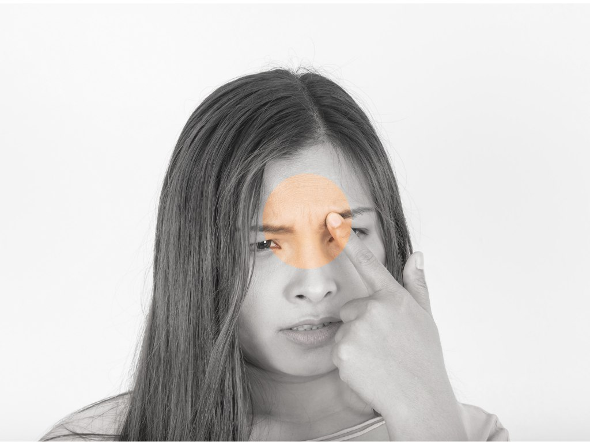
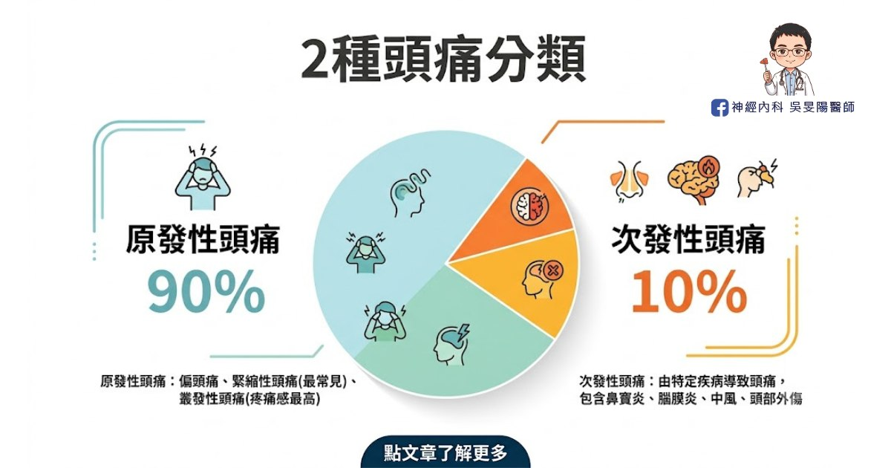
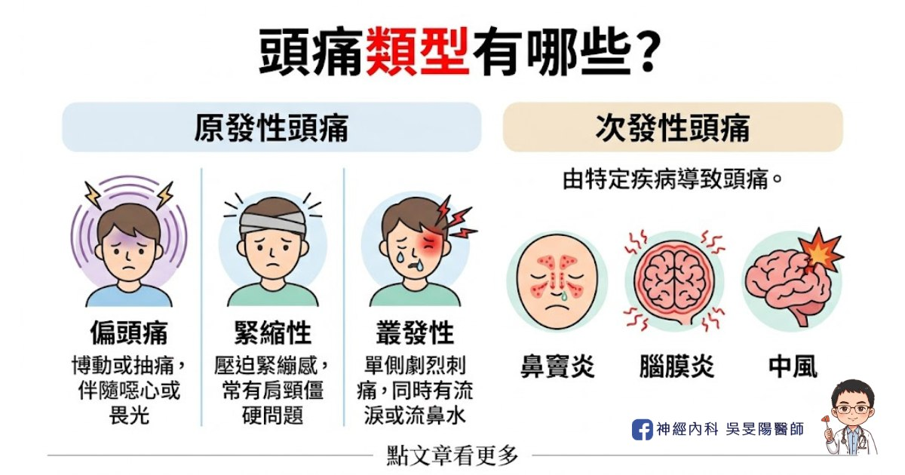
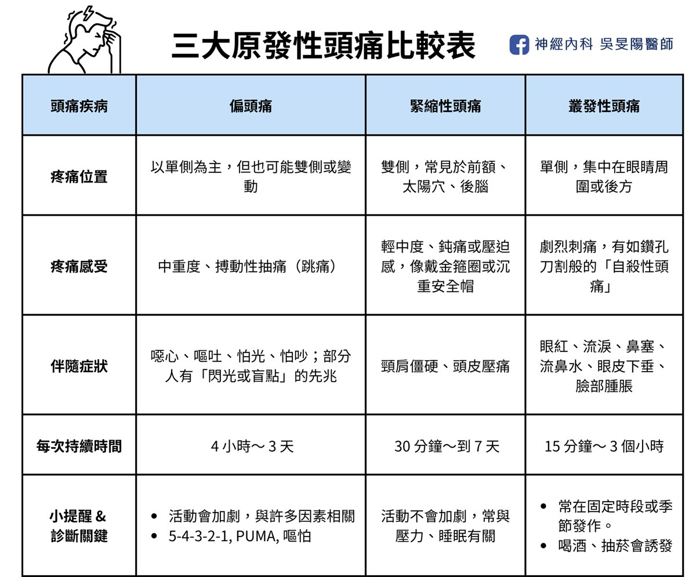

「我頭痛只痛一邊，是不是要中風了啊？」

「頭痛已經快 3 個月，吃藥都沒效，是不是長腦瘤了？」

頭痛的位置百百種，在問診時，都是不能放過的重要線索。事實上，頭痛背後常常藏著重要訊號，本系列文章將詳細介紹頭痛位置、可能病因和常見的頭痛類型，讓你了解自己的身體資訊。

## 頭痛 6 大位置看病因

頭痛可能由不同原因所致，因此需問更多問題：

「痛在哪裡？痛多久了？」

「痛的位置會不會變來變去？」

「是悶悶痛、抽痛，還是像針扎的刺痛？」

在我的頭痛門診裡，花時間聊細節是常態，絕非開抽血或照個片子就調查出來。推敲背後真正原因，才能安排正確檢查，進一步對症下藥。

看診時會被問什麼問題，請點下面文章：

[頭痛看診前必讀，醫生會問我什麼問題？](https://blog.drminyangwu.com/2024/12/blog-post.html)

### 1. 後腦勺痛

可能為緊縮型頭痛、頸源性頭痛、枕神經痛、高血壓頭痛、腦瘤、腦膜炎等等。

### 2. 太陽穴痛

常見為緊縮型頭痛、偏頭痛，也可能是叢發性頭痛、青光眼、牙齒、下巴關節問題。

### 3. 單側頭痛

典型的偏頭痛、叢發性頭痛特徵、也可能是頸源性頭痛。

### 4. 前額痛

緊縮型頭痛、鼻竇性頭痛、高血壓頭痛、或是腦瘤引起。

### 5. 眼睛、眼眶周圍或眉心痛

叢發性頭痛位置、鼻竇性頭痛、青光眼，也可能與頸源性頭痛相關。

### 6. 整顆頭痛

緊縮型頭痛、腦部感染、腦腫瘤都有可能性。

## 2 種頭痛分類：原發、次發

醫學上，頭痛大致分為 2 種：原發性和次發性頭痛，其中又以「原發性」更常見，好發於 20 ~ 50 歲的青壯年。以其中的偏頭痛來說，台灣大約有 10% 的人口 ( = 200 萬人 ) 有偏頭痛問題，也就是說，每 10 個人就有 1 個人是頭痛一族。

- **原發性頭痛**：超過 80 - 90% 頭痛都屬原發性頭痛，頭痛本身就是病因，如這 3 類：偏頭痛、緊縮型頭痛、叢發性頭痛。一般抽血、照腦部影像，結果幾乎都是「一切正常」，但可能是神經迴路和內分泌調控等其他問題。
- **次發性頭痛**：由特定疾病導致頭痛，比例約 10 - 20 % ，如鼻竇炎、腦膜炎、腦出血、中風、腦腫瘤、頸椎問題……等等。雖然比例低，但背後的病因多樣，從疾病、外傷、環境、**飲食**、藥物，都可能是原因。

有關**飲食**部分，可參考我寫的這篇：[改善偏頭痛，該吃什麼呢？加分飲食 vs 地雷食物清單](https://blog.drminyangwu.com/2026/05/migraine-diet-recommendations-food-triggers.html)

## 常見頭痛類型：3 個原發性頭痛

最常見的頭痛類型是原發性，比例佔 90%，有 3 個類型：偏頭痛、緊縮性、叢發性，以下詳細介紹每個類型。

### 1. 偏頭痛 Migraine

常見的反覆性神經血管疾病，特徵為搏動性抽痛、常伴隨噁心想吐、畏光怕吵。

- 疼痛位置：多為「單側」頭痛，痛在太陽穴、前額、後腦勺，甚至眼眶後方。
- 疼痛感受：常見搏動性或抽痛，像血管在一跳一跳，或鬢角咻咻叫。
- 常見症狀：伴隨噁心嘔吐、怕光怕吵。
- 持續時間：每次頭痛持續從 4 小時 ～ 3 天。

▲有 6 成的病人是單側痛，但也有 3 成會兩邊一起痛，或位置變來變去。因此偏頭痛，並非只偏單邊痛！

▲1-2 成的頭痛患者會出現預兆，多半是視覺預兆，如看到閃光、模糊盲點，且持續 30 分鐘。

### 2. 緊縮型頭痛 Tension Type Headache

又稱為壓力性頭痛，是最普遍的頭痛類型，通常是雙側疼痛，多由壓力或肌肉緊繃引起。

- 疼痛位置：多為「雙邊」頭痛，常分布在前額、太陽穴、頭頂及後腦，也可能延伸至頸背。
- 疼痛感受：鈍痛、壓迫感或緊縮感，像頭部被緊緊束住，像戴上孫悟空的金箍圈、或很重的安全帽一樣。
- 常見症狀：可能同時有頸肩僵硬，摸頭皮會更痛，通常沒有噁心嘔吐感。
- 持續時間：時間範圍廣，持續從 30 分鐘 ～ 7 天都有可能。

### 3. 叢發性頭痛 Cluster Headache

又叫叢集性頭痛，特色是固定單側眼眶周圍，發生極度劇烈的密集疼痛，常伴隨同側流淚或流鼻水，好發於年輕男性。

- 疼痛位置：幾乎只發生在單側，通常集中在一眼後方或周圍，並往同側臉部、頭部和頸部擴散。
- 疼痛感受：像刀割、鑽孔般的尖銳刺痛，非常痛苦，發作時會躁動不安，被稱為「自殺性頭痛」。
- 常見症狀：同側會出現眼睛紅、流淚、眼皮下垂、眼瞼水腫、鼻塞、流鼻水，甚至臉部腫脹或冒汗。
- 持續時間：每次 15 分鐘～ 3 個小時，常常發作在每天同一時段、每年同一季節，可能長達數週到數月，最常發生在季節變換，以 3 月和 12 月最多。

▲最疼痛的是叢發性頭痛，比起偏頭痛、緊縮性來說，門診少見叢發性頭痛的病患，國外的叢發性頭痛盛行率約 3/1000。

## 三大原發性頭痛 速查表

本篇主要介紹頭痛位置、可能病因和3大常見的
原發性頭痛：偏頭痛、緊縮型頭痛、叢發性頭痛。

另一類是次發性頭痛，通常隱藏著其他疾病。如鼻竇性頭痛、頸源性頭痛、三叉神經痛等等，我放在下一篇：[當心致命「次發性頭痛」！ 一文看懂 7 個次發性頭痛原因、症狀、位置：頭痛地圖指南(下)](https://blog.drminyangwu.com/2025/09/secondary-headache-causes-warning-signs.html)

如有以上任何症狀，歡迎掛號至門診討論喔！

## 延伸閱讀

- [當心致命「次發性頭痛」！ 一文看懂 7 個次發性頭痛原因、症狀、位置：頭痛地圖指南(下)](https://blog.drminyangwu.com/2025/09/secondary-headache-causes-warning-signs.html)
- [頭痛看診前必讀，醫生會問我什麼問題？](https://blog.drminyangwu.com/2024/12/blog-post.html)
- [10 大危險頭痛警訊！哪些情況需要看醫生，一次告訴你](https://blog.drminyangwu.com/2024/11/10.html)
- [「頭痛」不是小事！認識「偏頭痛」的失能危機](https://blog.drminyangwu.com/2025/02/migraine-disability-cost-anxiety-.html)
- [改善偏頭痛，該吃什麼呢？加分飲食 vs 地雷食物清單](https://blog.drminyangwu.com/2026/05/migraine-diet-recommendations-food-triggers.html)

## 參考資料

- [Headache Locations: A Comprehensive Guide](https://www.webmd.com/migraines-headaches/understanding-headache-location-comprehensive-guide)
- 2022 台灣頭痛學會 民眾衛教手冊 《告別偏頭痛該知道的100件事》
