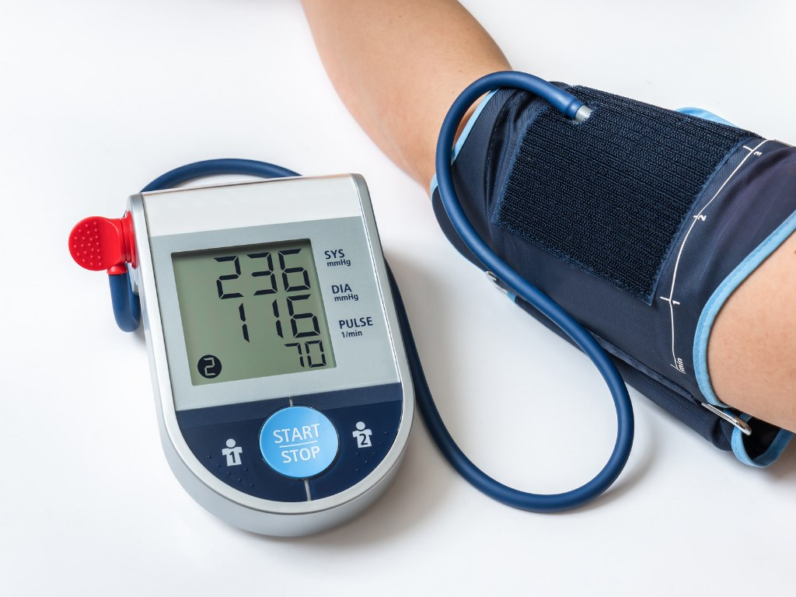
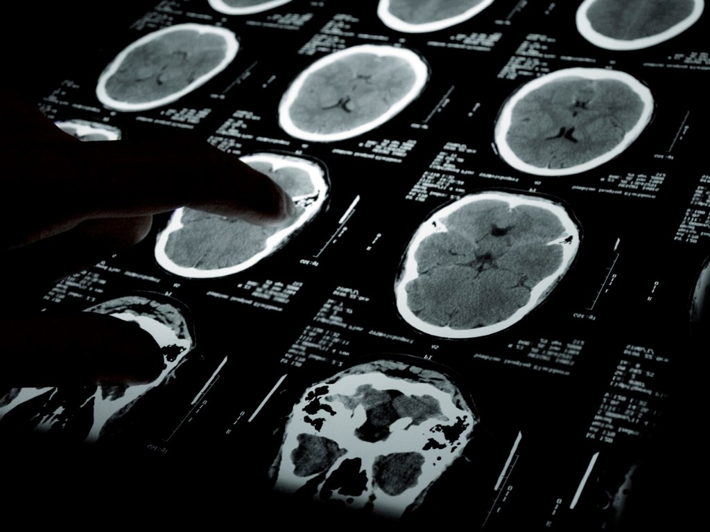

我們常說「頭痛」是很常見的症狀，但其實有另一類頭痛，並非單純的原發性頭痛，而是**次發性頭痛**，是由其他疾病引發的頭痛。通常頭痛只是冰山一角，真正的重點在找出背後的病因，才能真正解決問題。

所以，**一旦出現不尋常或警訊型的頭痛，一定要找醫師檢查！**請看這篇[10 大危險頭痛警訊！哪些情況需要看醫生，一次告訴你](/posts/headache-red-flags/)

本片文章將詳細介紹常見的 7 個次發性頭痛類型，包含疼痛位置、常見症狀和可能病因。

## 感冒後的「鼻竇性頭痛」

- **疼痛位置**：散布在前額、顴骨和鼻部
- **疼痛感受**：常常是壓痛感或悶痛感
- **常見症狀**：伴隨感冒症狀、鼻塞、流鼻涕、發燒、臉部腫脹等等
- **誘發因子**：彎腰或往前俯身時會更痛
- **可能病因**：
  1. 鼻竇感染 (過敏、細菌、病毒引起鼻竇炎)
  2. 鼻息肉、鼻中隔彎曲

## 肩頸痠痛的「頸源性頭痛」

- **疼痛位置**：後腦勺或單側頭痛，疼痛可能轉移到眼睛、頸部、肩部或手臂，也可能到頭頂、顳顎關節
- **常見症狀**：頸部僵硬、頸部的關節轉動困難或活動度降低，甚至伴隨噁心、視力模糊、光線和聲音敏感
- **誘發因子**：按壓頸部肌肉、頭部往後仰或脖子轉動時，出現由後往前傳的頭痛
- **可能病因**：
  1. 過去有頸椎骨、關節、椎間盤或軟組織舊傷，包含關節炎、感染、骨折、頸部肌肉扭傷或腫瘤
  2. 長期低頭、姿勢不良或頸部僵硬，導致肌肉緊繃。

## 電流刺痛的「枕神經痛」

- **疼痛位置**：後腦勺、上頸、耳後或頭頂
- **疼痛感受**：短暫、銳利、像電擊般的刺痛感
- **可能病因**：枕神經受壓迫或發炎
  - **枕神經**：後腦勺的頭皮底下的神經，走向從耳朵後面和脖子附近，延伸到頭頂

## 痛到難刷牙「三叉神經痛」

- **疼痛位置**：整張臉部都可能，幾乎單側發作，雙側發作少見
- **疼痛感受**：像銳利、刀割般、電擊般的抽痛，而且沒發作的時候近乎正常，每次疼痛的時間都不長，大約是幾秒鐘到2分鐘內，但是一天的發作次數可能會相當頻繁
- **誘發因子**： 咀嚼、進食、說話、洗臉、刷牙、刮鬍子、或是戴口罩都可能會引發疼痛
- **可能病因**：三叉神經受到動脈或是腫瘤的壓迫，也有可能找不到其他原因。
▲小提醒：一開始常被誤認為是牙痛，甚至有患者牙齒都拔了仍會痛，因此若是找不到原因的牙痛，就可能會是三叉神經痛喔！

## 「青光眼」引發頭痛

- **疼痛位置**：眼睛與眼眶周圍，可能延伸到太陽穴
- **疼痛感受**：劇烈頭痛，尤其是眼睛位置
- **常見症狀**：眼睛變紅、視力模糊、噁心、嘔吐，嚴重甚至有失明風險
- **可能病因**：眼壓過高，急性青光眼發作

▲小提醒：急性型非常危險，需要立即治療，否則可能造成**永久視力損害**。

## 「高血壓」引發的頭痛

- **疼痛位置**：較不一定，可能在後腦勺或前額
- **疼痛感受**：壓迫感或搏動性疼痛
- **誘發因子**：常在早晨最嚴重，甚至會使人痛醒，白天又逐漸減輕
- **可能病因**：嚴重高血壓（收縮壓 ≥ 200 mmHg，舒張壓 ≥ 110 mmHg）
▲小提醒：須注意，一般「血壓高＋頭痛」不等於危險，但若是**高血壓急症並伴隨神經症狀**、意識改變等，可能**危及生命**，也是頭痛該及早就醫的警訊！

## 「腦瘤」引發的頭痛

- **疼痛位置**：不固定，可能是整個頭、頭頂或後腦勺
- **疼痛感受**：持續性、漸進式頭痛
- **常見症狀**：伴隨噁心、嘔吐、視力模糊，甚至出現神經學異常（如意識模糊、口齒不清、身體單側麻木或無力，也可能痙攣或抽搐）
- **誘發因子**：平躺姿勢或剛睡醒時，會出現明顯頭痛
- **可能病因**：
  - 腦瘤壓迫腦部組織導致水腫，顱內壓升高
  - 癌症病史者，可能擴散轉移至腦部
▲小提醒：

1. 腦瘤引起症狀是漸漸出現，或變嚴重，通常代表嚴重顱內疾病，造成顱內壓升高、神經功能障礙，**潛在嚴重有致命危險**。
2. 頭痛患者，檢查出有腦瘤的機率不高，約 1%，所以不須過度焦慮。

## 結語：頭痛警訊要留意，及早尋求專業醫療協助！

1. 頭痛診斷是綜合性評估，了解疼痛位置、症狀和頻率可協助醫生做進一步的檢查。
2. 就診前，建議可做到 [頭痛看診前，先記下這五件事](../../posts/before-your-visit/)，有助於醫生診斷。
3. 頭痛症狀持續加劇，或伴隨危險警訊症狀，一定要尋求專業醫療協助！頭痛警訊請看這篇[10 大危險頭痛警訊！哪些情況需要看醫生，一次告訴你](/posts/headache-red-flags/)

如有以上任何症狀，歡迎掛號至門診討論喔！

## 延伸閱讀

- [太陽穴兩邊隱隱作痛？6大頭痛位置、可能病因、常見3大原發性頭痛一次看：頭痛地圖指南(上)](../../posts/headache-map-part1/)
- [吃冰會頭痛，也是一種病 – 什麼是「冰淇淋頭痛」？](https://blog.drminyangwu.com/2025/11/headachecold-stimulus-headache-brain-freeze-ice-cream.html)
- [頭痛看診前，先記下這五件事](../../posts/before-your-visit/)
- [10 大危險頭痛警訊！哪些情況需要看醫生，一次告訴你](/posts/headache-red-flags/)
- [「頭痛」不是小事！認識「偏頭痛」的失能危機](https://blog.drminyangwu.com/2025/02/migraine-disability-cost-anxiety-.html)
- [改善偏頭痛，該吃什麼呢？加分飲食 vs 地雷食物清單](https://blog.drminyangwu.com/2026/05/migraine-diet-recommendations-food-triggers.html)

## 參考資料

- [Headache Locations: A Comprehensive Guide](https://www.webmd.com/migraines-headaches/understanding-headache-location-comprehensive-guide)
- 2022 台灣頭痛學會 民眾衛教手冊 《告別偏頭痛該知道的100件事》
