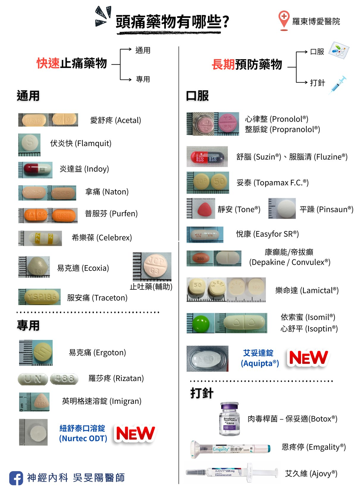

35 歲的張小姐，是位職業婦女。原本週末午後計畫好和先生孩子去草地野餐。但在出發後，熟悉的搏動性頭痛感突然襲來，伴隨著怕光怕吵的症狀。晴朗的陽光在此刻變的如針一樣刺眼，孩子興奮的笑鬧聲對她而言卻同噪音般，讓她感到煩躁以及頭痛加劇。

她只能向家人道歉，一個人蜷縮在陰涼安靜的停車場裡，吞下幾顆止痛藥，在噁心感與陣痛中掙扎。當她清醒過來，頭痛不適感消退之後，看著窗外昏暗的暮色，心裡滿滿地都是錯過與家人共度美好時光的愧疚。

這不是她第一次「缺席」自己的生活，止痛藥似乎越來越難救回這些被偷走的時光。病人曾在診間問我說：「以後出門，如果可以不用帶著這顆腦袋，是不是會好受一點？」

## 為什麼需要預防性治療？ 偏頭痛重要心法

對許多偏頭痛患者而言，這種疼痛除了生理上的煎熬，也是一個隨時不定時炸彈，炸毀了社交、工作與家庭時光。我們往往習慣在火燒起來時才忙著吞藥「滅火」，但如果這場大腦的風暴每週都來、甚至天天造訪，傳統的止痛藥往往會疲於奔命，甚至讓我們陷入「越吃越痛」的[藥物過度使用頭痛](/posts/medication-overuse-headache/)。

頭痛不該只是「痛了才醫」，平常就可以透過「[預防性治療](https://blog.drminyangwu.com/2025/06/migraine-medication-User-guide-prevention.html#point1)」，為大腦築起一道防火牆。接下來，我們就來盤點一下，這些能幫你奪回人生主控權的預防藥物，從傳統口服藥到 2024 年最受矚目的 Gepant 類新藥，看看它們如何改寫偏頭痛的治療劇本。

## 我需要預防治療嗎？「主動防火」比「被動救火」更重要！

以下幾點為醫學上常用的評估標準：

1. 偏頭痛每月發作超過 4 次
2. 止痛藥越吃越無效
3. 副作用不喜歡
4. 不想要常常吃止痛藥
5. 頭痛發作常常嚴重影響工作或生活品質（即使天數不多）
6. 特殊的偏頭痛型態（如預兆偏頭痛）

**如果你有符合上述情況，就該考慮吃預防藥。**

它的目標，就在於減少頭痛頻率、降低疼痛的嚴重度、縮短發作時間。預防性口服藥物的重點在於：**不論有沒有頭痛發作，每天都需要定期服用**；和有痛了才需要吃的止痛藥，是完全不同的模式。

請參考我的短文介紹：「[超過 7 成患者忽略的『關火法』](https://blog.drminyangwu.com/2025/06/migraine-medication-User-guide-prevention.html)」

- 核心觀念：預防藥 vs. 止痛藥的關鍵差異（**治本** vs. **治標**）

## 頭痛藥物圖鑑

以上整理了常見偏頭痛藥物的圖片彙整，希望頭痛病友們，來門診時也能方便讓大家快速認識它們～

有因為頭痛吃藥的人，看看你平常吃的那顆，是不是也在榜上！

▲小提醒：由於每個藥物的製造藥廠或牌子不同，不一定只長一個樣！可能會有成分相同，但是外觀不同的狀況。所以別只看外表，記得看清楚藥物包裝的成分說明！若有問題，直接詢問藥師或是醫師準沒錯！

## 預防藥家族的成員有哪些？

如上一段大圖的右側欄位，列舉出的預防藥物可分為口服藥與打針。口服藥物又可再分為五大類、針劑藥物為兩大類：

1. **乙型阻斷劑(Beta blocker)**
2. **鈣離子阻斷劑(Calcium channel blocker)**
3. **抗癲癇藥(Anti-convulsant)**
4. **抗憂鬱劑(Anti-depressant)**
5. [口服標靶藥](https://blog.drminyangwu.com/2024/10/2024-gepant.html#point3)（[艾妥達](https://blog.drminyangwu.com/2024/10/2024-gepant_28.html) (Aquipta)、[紐舒泰](https://blog.drminyangwu.com/2024/11/2024-gepant-rimegepantnurtec.html) (Nurtec)）
6. [單株抗體針劑](https://blog.drminyangwu.com/2026/03/migraine-prevention-part2-injections-cgrp-ajovy-emgality-botox.html#point3)
7. [肉毒桿菌素針劑](https://blog.drminyangwu.com/2026/03/migraine-prevention-part2-injections-cgrp-ajovy-emgality-botox.html#point4)

這篇我主要介紹前面 4 種藥物。

## 傳統口服預防藥物：經典的老牌班底

雖說是傳統藥物，但也是預防性治療的重要起步。在新型藥物被開發出來前，這些藥在臨床上守護偏頭痛病友已有數十年以上。就如同腦中風用藥 Bokey 100mg (伯基, 又叫做阿斯匹靈)，在腦中風新藥的出現下，它的地位仍無法取代。

這群藥物很有趣，它們原本的專業並非預防偏頭痛，而是在高血壓、癲癇或憂鬱症的領域發光發熱。但在醫學發展的過程中意外發現，這群藥物同時也能讓過度敏感的大腦「冷靜」下來，從而減少偏頭痛的發作。

然而，在我的門診常有患者擔憂，自己本身並沒有憂鬱症、癲癇、高血壓的問題，為什麼要長期服用這些藥物呢？

以下這些藥物都可以調控神經傳導物質的平衡。在門診我都會說這算是一種「**神經穩定劑**」，臨床研究證實，它們也同時有預防偏頭痛的療效，不只侷限在高血壓、憂鬱症或癲癇。因此醫生開立這些藥物，不是因為病友有癲癇或是憂鬱症，是因為它們也可以減少頭痛發作。

這些傳統口服藥物用於預防偏頭痛用途時，所需的劑量也比治療原生疾病（憂鬱、癲癇）低很多。舉例來說，妥泰藥物用在癲癇，劑量可達一天 400mg，但是用在偏頭痛的劑量約 50mg ~ 200mg 就已足夠；平躁藥物用在憂鬱症的劑量約莫在 100mg ~ 300mg 左右，但是偏頭痛只需用 10mg ~ 150mg 就行。此外，也因為劑量較低，對身體的負擔也較低。

### 一、乙型阻斷劑：讓大腦降溫

#### 代表藥物：心律整 (Pronolol®)

**機制**：這類藥物原本是治療高血壓與心律不整的基礎藥。它能減緩心跳、穩定自律神經。在偏頭痛方面，它能減少血管張力，減少腦血管收縮，進而降低頭痛發作頻率。就像是幫發燙的大腦降降溫，比較不容易燒起來。

**副作用**：可能會讓**血壓降低、心跳變慢、導致胸悶，甚至是惡化氣喘**。如果您本身患有氣喘、心跳偏慢、血壓較低等情形，我們會特別謹慎評估。我也有聽過患者分享會造成嗜睡、口渴或是手腳冰冷，初次使用需留意。

**我的選擇**：乙型阻斷劑在傳統口服藥當中，副作用相對為不明顯。再加上高血壓相當常見，因此只要病友沒有上述禁忌症，這個藥是我的第一選擇，順便一起治療高血壓。因為會降低心跳，建議剛吃完藥不要馬上去運動喔！

### 二、鈣離子通道阻斷劑：讓血管放鬆

#### 代表藥物：舒腦 (Suzin®)

**機制**：透過調節細胞內的鈣離子，防止腦部血管異常收縮與舒張，穩定腦血管管壁。

**副作用**： 常見為嗜睡或疲倦。此外還會導致食慾增加、體重增加。長期使用，亦有可能導致抑鬱、行動遲緩、顫抖等現象。

**我的選擇**：我常開給老人家使用，因為高齡患者也常常有慢性頭暈問題，可以一起治療。此外失眠患者也適合，剛好可以利用副作用幫助入睡。如果隔天早上嗜睡太過明顯，可以將藥物提前到晚餐吃，不要睡前才服用。

因為體重因素，年輕女性通常不愛，肥胖族群也不太適合。憂鬱症患者與巴金森氏症患者使用此種藥物需要特別小心！可能會加重原有病情。

### 三、抗癲癇藥物：讓神經減少放電

#### 代表藥物 1 號：妥泰 (Topamax®)

**機制**：偏頭痛發作時，大腦神經元會出現異常的放電。這類藥物通過調節神經傳導物質，能穩定神經細胞膜，避免席捲全腦的「電力風暴」。

**副作用**： 常見為手麻腳麻（感覺異常），體重減輕（食慾減退），認知障礙（俗稱腦霧）的情況。

▲手麻腳麻的副作用，可以透過攝取富含鉀離子的食物，譬如香蕉、柳丁、橘子、奇異果。也可以和維他命搭配服用。

▲認知的副作用一般吃到較高劑量才會出現，包含注意力不集中、記憶力變差等等。

**禁忌症**：青光眼患者禁止使用！此外，腎結石患者、孕婦也不建議使用。

▲在門診我們都會提醒病人吃藥之後若是出現眼痛、紅腫、流淚、眼睛充血、視力模糊等等，需要馬上停藥，並至眼科就醫。

▲妥泰藥物對於胎兒有不良影響，可能導致畸胎。

▲為了避免尿結石，建議多補充水分。

**我的選擇**：妥泰這一類的藥物是預防偏頭痛效果比較強的，因此臨床上我若是遇到患者吃前幾種藥物都沒效時，就會考慮使用它。若是頭痛發作相當頻繁或是嚴重的偏頭痛，也會將此藥列為首選藥物。

**重要角色**：台灣健保規定，若需要申請健保給付的長效針劑，都必須先吃過妥泰！

#### 代表藥物 2 號：帝拔癲 (Depakine)、康癲能 (Convulex)

**機制**：同上

**副作用**：可能導致**肝功能異常**、血小板（血液凝固所需）異常，進而導致延長出血時間。此外也可能導致嗜睡疲倦、掉髮、顫抖、和體重增加！

▲少數患者會導致嚴重的皮膚過敏反應，此時應立即停藥並盡快回診求治。

**禁忌症**：孕婦禁止使用！

▲就像上面提到的妥泰藥物，帝拔癲對於胎兒亦有不良影響，可能導致畸胎。

**我的選擇**：這個藥物的副作用比較多⋯⋯所以我比較少用，因為可能導致肥胖、掉髮、也對孕婦有禁忌症。對於女性病患來說相當不友善，偏頭痛病友又以女性偏多。在老年人族群、男性病患、或是合併癲癇的病友身上，比較有出場機會。

### 四、抗憂鬱劑：強化止痛機制

#### 代表藥物 1 號：平躁 (Pinsaun®)、靜安 (Tone®)

**機制**：透過調節腦中的血清素及正腎上腺素的濃度，這兩種物質是大腦「止痛系統」的關鍵要素，減少痛覺向下傳遞。彷彿踩下煞車，來直接減弱疼痛警報的訊號強度。

**副作用**： 常見有三大：嗜睡、口乾、便秘與小便不順、視力模糊。另外也可能導致體重增加。

▲攝護腺肥大的男性需謹慎使用，因可能導致解尿困難。

▲有青光眼的患者亦不建議使用！

▲剛開始服用盡量避免開車，也不建議喝酒。

**禁忌症**：特定心律不整患者

**我的選擇**：由於本身是抗憂鬱劑，再加上頭痛患者也常有焦慮、失眠、憂鬱的問題。就可以一起治療。我在門診很常開立給偏頭痛初診病患，尤其是容易緊張/焦慮、食慾差、身形偏瘦的頭痛女性族群。比較需要注意的是嗜睡的副作用，如果嚴重的話可以改到晚上或是睡前服用。

值得注意的是，平躁 (Pinsaun®) 也是唯一核准用來治療**[緊縮型頭痛](/posts/headache-map-part1/#2-緊縮型頭痛-tension-type-headache)**的預防藥物，可謂一石二鳥！

#### 代表藥物 2 號：悅康 (Easyfor SR®) or 速悅 (Effexor XR®)

**機制**：同上

**副作用**：因為有抗憂鬱效果，可能會有導致興奮、失眠、盜汗、血壓變高、心跳變快、噁心嘔吐等等。也可能導致口乾、便秘、排尿困難。

▲心臟衰竭、心肌梗塞、甲狀腺亢進的族群需謹慎使用！

**我的選擇**：同上，若偏頭痛合併憂鬱、焦慮、恐慌症等等，此藥可以優先使用。但是要先度過副作用這一關。也需要持續服用一段時間，才能發揮預防頭痛效果。

## 其他用藥觀念

- **起步要慢**(Start low, Go slow)：為了減少副作用，醫師通常會從最低劑量開始使用。
- **不要自行停藥**：就像防火工程不能蓋一半就撤走工人，持續使用預防藥物一段時間之後，請勿突然自行停藥！除了可能面臨偏頭痛惡化的風險，也可能衍生其他副作用。需要與醫師討論，並慢慢的調降劑量。
- **除了耐心、還是耐心**：就像減重一樣，需要持之以恆。

雖然這群老牌藥物各有各的小脾氣（副作用），且需要每天服用，但它們優點在於價格親民且健保給付完善。對於大多數患者來說，它們依然是標準用藥。

## 醫病用藥決策：我該選擇哪種傳統口服預防藥物？

評估雙面向：

1. 頭痛頻率與生活影響程度
2. 其他共病史（如合併憂鬱、肥胖、焦慮、失眠等等）

- 若合併憂鬱症，可優先選擇抗憂鬱劑類藥物；並謹慎使用舒腦 (Suzin®)
- 若合併癲癇，可優先選擇抗癲癇藥物；並謹慎使用部分抗憂鬱劑
- 若合併頭暈，可優先選擇舒腦 (Suzin®)
- 若合併失眠，可優先選擇舒腦 (Suzin®) 或是抗憂鬱劑
- 若合併高血壓，可優先選擇乙型阻斷劑，或是鈣離子通道阻斷劑
- 若合併氣喘，避免使用乙型阻斷劑！
- 若有肥胖問題，可優先使用妥泰 (Topamax®)；並謹慎使用舒腦 (Suzin®) 或抗憂鬱劑
- 若有青光眼病史，避免使用妥泰 (Topamax®) 和部分抗憂鬱劑
- 若有腎結石病史，需謹慎使用妥泰 (Topamax®)
- 若有懷孕，可優先考慮乙型阻斷劑、或是平躁 (Pinsaun®)

可在門診與醫師討論，根據病患的服藥反應，我們會盡量在療效與副作用之間，為病患找到一個平衡點，可以長期服藥一段時間。

## 病友迷思破解：門診大哉問

### 「預防藥要吃一輩子嗎？」

- 根據研究，療程通常 6~12 個月，如果後續頭痛發作頻率極低（例如一週不到一次），或是認為已不影響生活工作，就可以逐步減藥或停藥。停藥過後就相當於畢業，不用規律服藥，偶爾有痛再吃止痛藥即可。
- 但需要注意，偏頭痛是一種體質，接受過完整預防性藥物療程後，頭痛可能會再因為外在因素（氣候、生活壓力…等）又再度復發。
- 我常在診間告訴病患：**預防藥物不用吃一輩子，但是需要吃一陣子**。雖然比較難一勞永逸，但是大多數可以治療到穩定幾乎不發作。

### 「新藥一定更好嗎？」

- 傳統不代表「比較差」。傳統藥對多數族群仍有效，半數的患者在使用傳統口服藥之後，偏頭痛可以得到良好控制，就不一定需要新藥。
- 新藥的優勢在於副作用更少，效果更專一，但是可能更花錢，或者是需要額外寫頭痛日記申請。
- 新藥與舊藥之間，就好比是高鐵和客運的關係，各有適合的對象，詳細討論請點閱[貼文連結](https://www.facebook.com/share/p/1Asq9umW5U/)。
- 沒有最好的藥，只有最「適合」自己的藥物。

### 「一直吃抗癲癇藥物、抗憂鬱藥物來預防偏頭痛，未來是否就會得到癲癇或憂鬱症？」

- 不會！如同上述所說，治療偏頭痛的所需劑量較低，而且藥物主要用於穩定腦內神經物質平衡，不會引起疾病。

### 「只要是高血壓藥物、抗癲癇藥物、抗憂鬱藥物就都對偏頭痛有效嗎？」

- 只有特定的幾個藥物才有效喔，因此民眾也不要覺得已經有在吃高血壓等等的藥，就覺得有在治療偏頭痛喔！仍需詢問神經科醫師的專業意見。

### 「天天吃預防藥，會不會越吃越沒效？」

- 預防藥物天天吃，才能發揮效果。
- 若是越吃頭越痛、效果不佳，可能是頑固型偏頭痛，又或者根本不是偏頭痛的問題！（例如腦部感染、腦血管病變、腦部腫瘤等等…）。此時建議掛號神經科醫師，評估是否安排進一步檢查或抽血喔！可參考〔[頭痛要留意的 10 個警訊](/posts/headache-red-flags/)〕

## 結語：規律服藥，贏回頭痛自主權

回頭看看開頭提到的張小姐，她在了解「預防性治療」的觀念後，與醫師討論並開始服用預防藥物。雖然剛開始服用時有些微的口乾與嗜睡，但在穩定服藥六週後，她驚訝地發現：那個每週末準時報到的「頭錘感」竟然消失了。即便偶爾發作，程度也變得輕微許多，一顆簡單的止痛藥就能解決。

這些傳統的口服藥物雖然不像最新型的標靶藥物那樣「精準直達」，但它們就像是一群默默耕耘的基礎工兵，為我們敏感的大腦神經重新佈線、打好地基。

### 呼籲行動

1. **開啟「[頭痛日記](/posts/headache-visit-questions/#頭痛病友小幫手頭痛日記)」**：記錄下每個月發作的天數、痛感程度與藥物使用量。這對醫師評估是否啟動預防治療至關重要。
2. **與醫師對話**：拿著這篇文章或您的頭痛紀錄，與神經內科醫師討論：「我是否符合預防治療的標準？」、「哪一種口服藥最適合我的生活型態？」
3. **給藥物一點時間**：記住「馬拉松法則」，不要因為吃了一週沒效就放棄。大腦的調整需要時間，而這份耐心有望將會換來生活品質的飛躍。

現今偏頭痛治療選項非常多樣，每位病友一定都找的到最順手的武器，打擊偏頭痛！

在下一篇文章中，我們將跨入更現代化的醫療領域，介紹那些「一個月打一針」就能精準截斷疼痛信號的[新型長效針劑](https://blog.drminyangwu.com/2026/03/migraine-prevention-part2-injections-cgrp-ajovy-emgality-botox.html)。

其他細節，歡迎到診間找醫師討論喔！

## 延伸閱讀

- [2 分鐘，快速認識偏頭痛治療](https://blog.drminyangwu.com/2026/04/video-migraine-quick-guide-prevention-2-minutes.html)
- [藥物知多少？偏頭痛「預防性治療」全攻略（二）：新型長效針劑篇 － 個論](https://blog.drminyangwu.com/2026/03/migraine-prevention-part2-injections-cgrp-ajovy-emgality-botox.html)
- [藥物知多少？偏頭痛「預防性治療」全攻略（二）：新型長效針劑篇 － 綜合比較與選擇建議](https://blog.drminyangwu.com/2026/03/migraine-injections-comparison-cgrp-vs-botox-how-to-choose-cost-and-decision-guide.html)
- [偏頭痛不是多吃止痛藥就能解決！超過 7 成患者忽略的「關火法」才是關鍵](https://blog.drminyangwu.com/2025/06/migraine-medication-User-guide-prevention.html)
- [為何治療高血壓的藥物，也同時有預防偏頭痛的效果？](https://blog.drminyangwu.com/2025/01/seminar%20Update%20on%20integrating%20new%20migraine%20treatment%20clinical%20pearls.html#point1)
- [10 大危險頭痛警訊！哪些情況需要看醫生，一次告訴你](/posts/headache-red-flags/)
- [頭痛看診前必讀，醫生會問我什麼問題？](/posts/headache-visit-questions/)
- [「頭痛」不是小事！認識「偏頭痛」的失能危機](https://blog.drminyangwu.com/2025/02/migraine-disability-cost-anxiety-.html)
- [瞄準偏頭痛的銀色子彈 –2024 年新型口服藥（Gepant）簡介](https://blog.drminyangwu.com/2024/10/2024-gepant.html)
- [改善偏頭痛，該吃什麼呢？加分飲食 vs 地雷食物清單](https://blog.drminyangwu.com/2026/05/migraine-diet-recommendations-food-triggers.html)

## 參考資料

- 台灣頭痛學會：[2025 偏頭痛衛教四摺頁](https://taiwanheadache.org.tw/wp-content/uploads/2025/10/2025%E5%81%8F%E9%A0%AD%E7%97%9B%E8%A1%9B%E6%95%99%E5%9B%9B%E6%91%BA%E9%A0%81_%E5%96%AE%E9%A0%81-1.pdf)
- [2022 台灣偏頭痛預防性治療準則](https://taiwanheadache.org.tw/wp-content/uploads/2022/10/2022-%E5%81%8F%E9%A0%AD%E7%97%9B%E9%A0%90%E9%98%B2%E6%80%A7%E6%B2%BB%E7%99%82%E6%BA%96%E5%89%87-revised.pdf)
- [請問偏頭痛預防性口服藥物有哪些？](https://taiwanheadache.org.tw/medication-ins/%E8%AB%8B%E5%95%8F%E5%81%8F%E9%A0%AD%E7%97%9B%E9%A0%90%E9%98%B2%E6%80%A7%E5%8F%A3%E6%9C%8D%E8%97%A5%E7%89%A9%E6%9C%89%E5%93%AA%E4%BA%9B%EF%BC%9F/)
- 2022 台灣頭痛學會民眾衛教手冊
