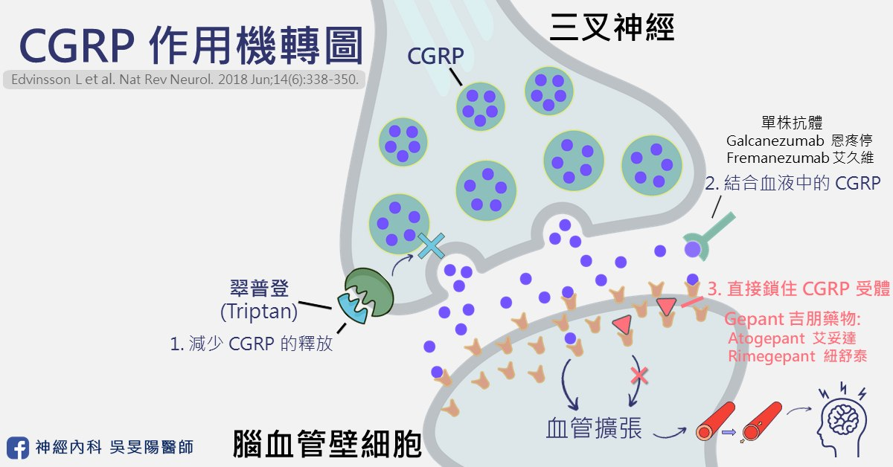
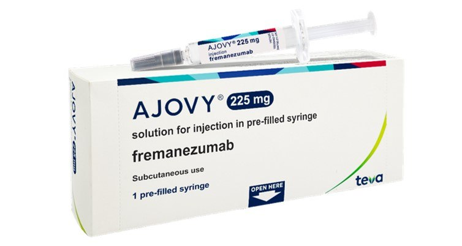
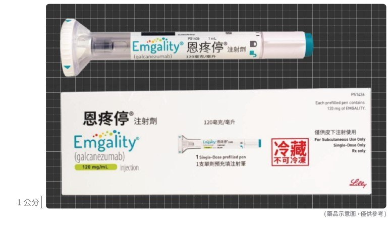
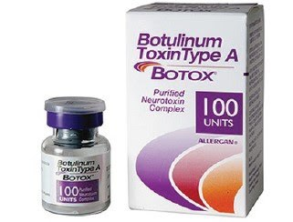

前面有介紹到[預防藥的成員們](/posts/migraine-prevention-oral/#預防藥家族的成員有哪些)，在第二部分，我們進入了偏頭痛治療的「現代精準化」階段。對於像張小姐一樣，卻無法忍受傳統口服藥的副作用、或是即便同時吃了兩、三種藥效果仍不理想的病友來說，這兩類治療方式簡直是「高科技拯救生活」的典範。

如果傳統口服藥是「無差別」的轟炸機，那麼 CGRP 單株抗體針劑就是現代戰爭中的「**精準導彈**」。

## 陣發性偏頭痛 vs 慢性偏頭痛

在進入正文前，病友們需要知道，偏頭痛可分為「陣發性偏頭痛」和「慢性偏頭痛」。兩種是根據「頭痛頻率」區分的，一個月頭痛天數小於 15 天，是陣發性偏頭痛；反之就是「慢性偏頭痛」。

因此，慢性偏頭痛，指的並不是頭痛的狀況很久了，而是發作的相當頻繁。簡單來說，我在門診都會問病人一句話，「你會覺得一個月裡面，平均有一半的日子都在痛嗎？」。

這樣就能快速區分！知道自己屬於哪一種型態的偏頭痛，是選擇預防藥物的第一步。也是很關鍵的[頭痛觀察要點](/posts/headache-visit-questions/#頭痛-5-大觀察重點)～

## 頭痛藥物圖鑑

## 它們如何減少偏頭痛發作？

[上一篇](/posts/migraine-prevention-oral/#傳統口服預防藥物經典的老牌班底)有介紹到，傳統口服藥物們其實主要是用來治療高血壓、癲癇或憂鬱症的疾病。為透過讓大腦降溫、血管放鬆、減少神經放電等多種作用機轉，彷彿就是「無差別的轟炸機」，無可避免地也會干擾身體其他功能。

科普一下，**CGRP（降鈣素基因相關胜肽）**是引起偏頭痛的重大元兇！它會擴張腦血管、誘發頭痛，或是神經發炎。偏頭痛發作時，大腦內的 CGRP 濃度也會升高；當頭痛改善了，CGRP 的濃度就會下降。

而「CGRP 單株抗體」堪稱全球少數可「專攻」偏頭痛的預防藥，像是一枚「精準導引飛彈」，它專門鎖定並阻斷偏頭痛關鍵角色 CGRP，只在頭痛發作路徑上發揮作用，不會波及全身其他機制。這種「狙擊式打擊」，不僅能更有效地預防頭痛，且副作用更少。此外，它也是減少「[藥物過度使用頭痛](/posts/medication-overuse-headache/)」的重要功臣之一！

目前我們所有的**新型藥物（包含肉毒桿菌、單株抗體、還有新型口服標靶藥物）**，全都和 CGRP 有關！關於 CGRP 相關藥物的機轉，我在之前介紹[口服標靶藥物](https://blog.drminyangwu.com/2024/10/2024-gepant.html#point2)也有提過，有興趣的讀者也可點個連結，一起服用。

補充一下，肉毒桿菌的機制，除了可能和抑制 CGRP 的釋放有關以外，它們也能減低感覺神經的疼痛傳遞有關。就像是在神經末梢加裝了「靜音耳機」，讓疼痛訊號無法傳達到大腦。

有趣的是，口服標靶藥物和單株抗體同樣都是減少 CGRP 的作用，只是單株抗體的目標作用在較上游、口服標靶藥物在下游路徑。可以看上面我做的精美圖片，相信能讓各位一目了然！

## 一、精準打擊：CGRP 單株抗體針劑

### 艾久維 (Ajovy®, Fremanezumab)、恩疼停 (Emgality®, Galcanezumab)

**適合族群**：陣發性偏頭痛、和慢性偏頭痛的患者，皆有研究證實有效！

**使用頻率與劑量**：

- 艾久維 (Ajovy®) 可選擇每月皮下注射一次，每次一針；或每季（3 個月）注射一次（一次打三針）。
- 恩疼停 (Emgality®) 每個月皮下注射一次。且第一個月需注射兩支的劑量。

**作用時間**：

- 起效時間：數天～數週。
  ▲研究指出，部分病人在注射過後一週左右的時間，就感受到頭痛頻率下降，甚至只要一天就覺得改善有感！綜觀所有偏頭痛的預防藥來說，它幾乎可說是最快速的！
- 持續時間：約 1~3 個月

**用藥方式**：(注射部位可在腹部、大腿或上臂)

- 艾久維 (Ajovy®) 為傳統手動按壓之注射針
- 恩疼停 (Emgality®) 為全自動注射筆針

**副作用**：常見為注射部位的反應（如局部疼痛、紅腫、紅班等）與便祕。比起傳統口服藥物來說，這類藥物相對安全許多！

**禁忌症**：

1. 心血管疾病患（例如心肌梗塞、中風病史者）者不太建議使用
2. 孕婦、哺乳中女性等特殊族群的用藥安全性尚未確認，若有這些情況請找醫師討論！
3. 偏癱型預兆偏頭痛、或是腦幹預兆偏頭痛患者，不太建議使用。

**我的使用心得**：病患打完之後，都會和我描述有種腦袋煥然一新的感覺。以下幾個特點，使它們成為偏頭痛界的「萬元精品預防針」。

- **目標族群廣**：不論你是一個月只痛幾天的陣發性偏頭痛患者、還是幾乎整個月都在痛的慢性偏頭痛患者，它都可以應付！
- **效果好**：傳統藥吃了沒什麼感覺？這支針可能就有感。
- **作用快**：傳統藥等兩週～四週，單株抗體幾天～一週內就能見效！
- **副作用少**：頂多打針的地方疼痛、癢癢、腫腫，比起傳統預防口服藥，它的副作用少很多。
- **忙人友善**：可以選擇一個月打一次，更可以選擇三個月打一次，根本懶人福音！
- **價格高了點**：若自費施打，一針需花費將近一萬塊左右，像是在買高級保養品，不過是在保養你的「腦」。

**健保給付**：慢性偏頭痛患者可享有健保有條件給付；至於陣發性偏頭痛患者目前台灣健保並無給付，需自費施打。

- 基本條件為：已服用 3 種 (含) 以上偏頭痛預防用藥物（必須包含[妥泰 Topiramate](/posts/migraine-prevention-oral/#三抗癲癇藥物讓神經減少放電)），仍然每個月頭痛天數 > 15 天之慢性偏頭痛患者。
- 第二條件為：病患需撰寫至少 3 個月的[頭痛日記](/posts/headache-visit-questions/#頭痛病友小幫手頭痛日記)，並交由醫師送審。
- 療程分為兩階段審查，需要由神經科醫師事先送件，健保局核可後才能開立藥物。

**健保療程**：第一次審查核准後，健保會給付 3 個月的療程。到期後需重新評估每月頭痛天數並重新送件，需比治療前降低 50% 以上，方可持續給付第二次療程（也是 3 個月）。

▲完整療程為半年，完畢後**半年內**不得再次申請。

**自費施打**：請看下篇〔**[綜合比較與選擇建議](/posts/migraine-injections-comparison/)**〕的段落〔[自費使用考量](/posts/migraine-injections-comparison/#自費使用考量不只是買藥更是買時間)〕

## 二、多點持久戰力：肉毒桿菌素 (Botox)

聽到「肉毒桿菌」，大家第一反應通常是：「醫美、變年輕、回春十八歲？」。但其實，它在醫學上的用途可多了！它可以用來治療偏頭痛、顏面痙攣（臉部/眼皮不自覺抽動）、中風後的手腳痙攣，斜頸症、甚至多汗症、膀胱過動症也派得上用場！

### 保妥適 (Botox®, Botulinum Toxin Type A)

**適合族群**：慢性偏頭痛

- 對於陣發性偏頭痛，並無臨床實證能確定療效，因此不推薦使用。

**使用頻率與劑量**：

- 每季（3 個月）注射一次。
- 每次打 155~195 個單位的肉毒桿菌。

**作用時間**：

- 起效時間：數週～數月。
  ▲一般注射約 2 週後，可觀察到偏頭痛發作減少。
- 持續時間：約 3~4 個月

**用藥方式**：

- 每次注射在多個點位（共 31~39 個點），遍佈在前額頭、兩側頭皮、後腦杓、以及肩膀。
- 注射後 4 小時內，避免洗臉洗頭、臉部按摩或揉捏注射部位、低頭、躺床睡覺、或劇烈運動，可減少藥物擴散到鄰近部位，產生多餘的副作用。
- 由於打法和劑量的特殊性，施打醫師必須參加台灣頭痛學會舉辦的訓練課程，取得認證才能施打。

**副作用**：安全性相當高，幾乎無全身性副作用。局部副作用包括：眉毛末端上揚（約 25%）、頸部疼痛（2~4%）、眼瞼下垂（2~5%）、或注射部位疼痛（約 2%）。

▲這些反應大多輕微，若真的不幸發生，也會在 1~3 個月內自然緩解，不會留下後遺症。

▲我在門診會建議病人第一次打完針後，先觀察 30 分鐘，確認有無不適。回家之後再觀察兩個禮拜並回診，看看有無上述副作用。

全身性的副作用較為罕見，請參考下一篇的段落〔**[病友迷思破解](/posts/migraine-injections-comparison/#病友迷思破解門診大哉問)**〕

▲肉毒桿菌阻斷頭痛訊號的同時，也有放鬆肌肉、麻痺神經的作用。若劑量或位置不正確，麻痺到重要的神經肌肉功能（例如呼吸肌肉），可就不是鬧著玩的！

**禁忌症**：若有以下情形，不建議施打！

- 注射部位有傷口、或是感染情形
- 吞嚥困難、呼吸困難者
- 患有神經肌肉疾病，例如重症肌無力、或者其他肌無力情形者
- 對於肉毒桿菌素過敏

**我的使用心得**：儘管肉毒生效的時間相較於單株抗體，比較長一些，但是它持續的效果也更長；此外也有人擔心打那麼多針會痛，但我們都是用非常小號的針頭打肉毒，比一般抽血用的針頭還要細，因此不用太過害怕喔。

- **覆蓋範圍廣**：頭痛的部位基本上都打的到，多點注射，阻斷疼痛信號。
- **效果好**：傳統藥吃了沒什麼效果的話，肉毒可能是你的救星。
- **忙人友善**：不像傳統口服藥要天天吃，肉毒桿菌三個月打一次就好，根本懶人福音！對於居住在外縣市的病人也很方便。
- **效果更持久**：打一次肉毒，可以持續 3 個月！健保給付最多 6 次施打，換算下來療程長達一年半 (18 個月)，是單株抗體的 3 倍長時間。
- **副作用少**：幾乎不會有傳統藥的全身性副作用。主要是眉毛末稍可能往上翹、打針處疼痛、眼瞼下垂。
- **附帶醫美功效**：雖然不是主要作用，但是打在額頭上是有機會消除魚尾紋或是抬頭紋。

**健保給付**：慢性偏頭痛患者一樣可享有健保有條件給付，**條件和單株抗體的雷同**。

- 基本條件為：已服用 3 種 (含) 以上偏頭痛預防用藥物（必須包含[妥泰 Topiramate](/posts/migraine-prevention-oral/#三抗癲癇藥物讓神經減少放電)），仍然每個月頭痛天數 > 15 天之慢性偏頭痛患者。
- 第二條件為：病患需撰寫至少 3 個月的[頭痛日記](/posts/headache-visit-questions/#頭痛病友小幫手頭痛日記)，並交由醫師送審。
- 療程分為兩階段審查，需要由神經科醫師事先送件，健保局核可後才能開立藥物。

**健保療程**：第一次審查核准後，健保會給付 6 個月的療程（可施打 2 次）。到期後需重新評估每月頭痛天數並重新送件，需比治療前降低 50% 以上，方可持續給付接下來 1 年的療程（可施打 4 次）。

▲完整療程為一年半，完畢後**半年內**不得再次申請。

**自費施打**：請看下一篇〔**[綜合比較與選擇建議](/posts/migraine-injections-comparison/)**〕的〔[自費使用考量](/posts/migraine-injections-comparison/#自費使用考量不只是買藥更是買時間)〕段落

## 下篇待續…

先感謝你閱讀到這裡～我在撰寫的過程中發現，可以分享的內容蠻多的，決定再多一篇篇幅介紹它們。[下篇文章](/posts/migraine-injections-comparison/)，我會再將針劑藥物做綜合比較、自費方式考量、和整理幾個病友常見迷思與問題集等等。

## 延伸閱讀

- [頭痛看診前必讀，醫生會問我什麼問題？](/posts/headache-visit-questions/)
- [偏頭痛不是多吃止痛藥就能解決！超過 7 成患者忽略的「關火法」才是關鍵](https://blog.drminyangwu.com/2025/06/migraine-medication-User-guide-prevention.html)
- [偏頭痛「預防藥治療」攻略：傳統口服藥 (一)](/posts/migraine-prevention-oral/)
- [偏頭痛「預防藥治療」攻略：長效針劑比較和選擇 (三)](/posts/migraine-injections-comparison/)
- [瞄準偏頭痛的銀色子彈 –2024 年新型口服藥（Gepant）簡介 (上) — 機轉](https://blog.drminyangwu.com/2024/10/2024-gepant.html)
- [20250109 羅東博愛醫院大內科部 – 偏頭痛臨床實務與新知分享](https://blog.drminyangwu.com/2025/01/seminar%20Update%20on%20integrating%20new%20migraine%20treatment%20clinical%20pearls.html)

## 參考資料

- [請問偏頭痛預防性注射針劑有哪些？](https://taiwanheadache.org.tw/medication-ins/%e8%ab%8b%e5%95%8f%e5%81%8f%e9%a0%ad%e7%97%9b%e9%a0%90%e9%98%b2%e6%80%a7%e6%b3%a8%e5%b0%84%e9%87%9d%e5%8a%91%e6%9c%89%e5%93%aa%e4%ba%9b%ef%bc%9f/)（台灣頭痛學會）
- [2022 台灣偏頭痛預防性治療準則](https://taiwanheadache.org.tw/wp-content/uploads/2022/10/2022-%E5%81%8F%E9%A0%AD%E7%97%9B%E9%A0%90%E9%98%B2%E6%80%A7%E6%B2%BB%E7%99%82%E6%BA%96%E5%89%87-revised.pdf)
- [International Headache Society Global Practice Recommendations for Preventive Pharmacological Treatment of Migraine](https://pubmed.ncbi.nlm.nih.gov/39262214/)：國際頭痛學會，偏頭痛預防性藥物治療之全球臨床指南建議
- 台灣頭痛學會：[2025 偏頭痛衛教四摺頁](https://taiwanheadache.org.tw/wp-content/uploads/2025/10/2025%E5%81%8F%E9%A0%AD%E7%97%9B%E8%A1%9B%E6%95%99%E5%9B%9B%E6%91%BA%E9%A0%81_%E5%96%AE%E9%A0%81-1.pdf)
- 2022 台灣頭痛學會民眾衛教手冊
- [長安神經醫學中心：偏頭痛、長期頭痛 (CGRP 單株抗體)](http://www.everanhospital.com.tw/neuro/treatment-items/item/260.html)
- [減輕肌肉痙攣的肉毒桿菌注射](https://epaper.ntuh.gov.tw/health/202504/special_1_1.html)（台大醫院健康電子報）
