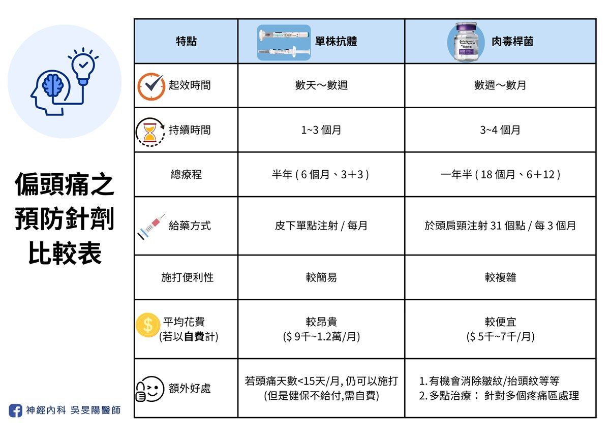
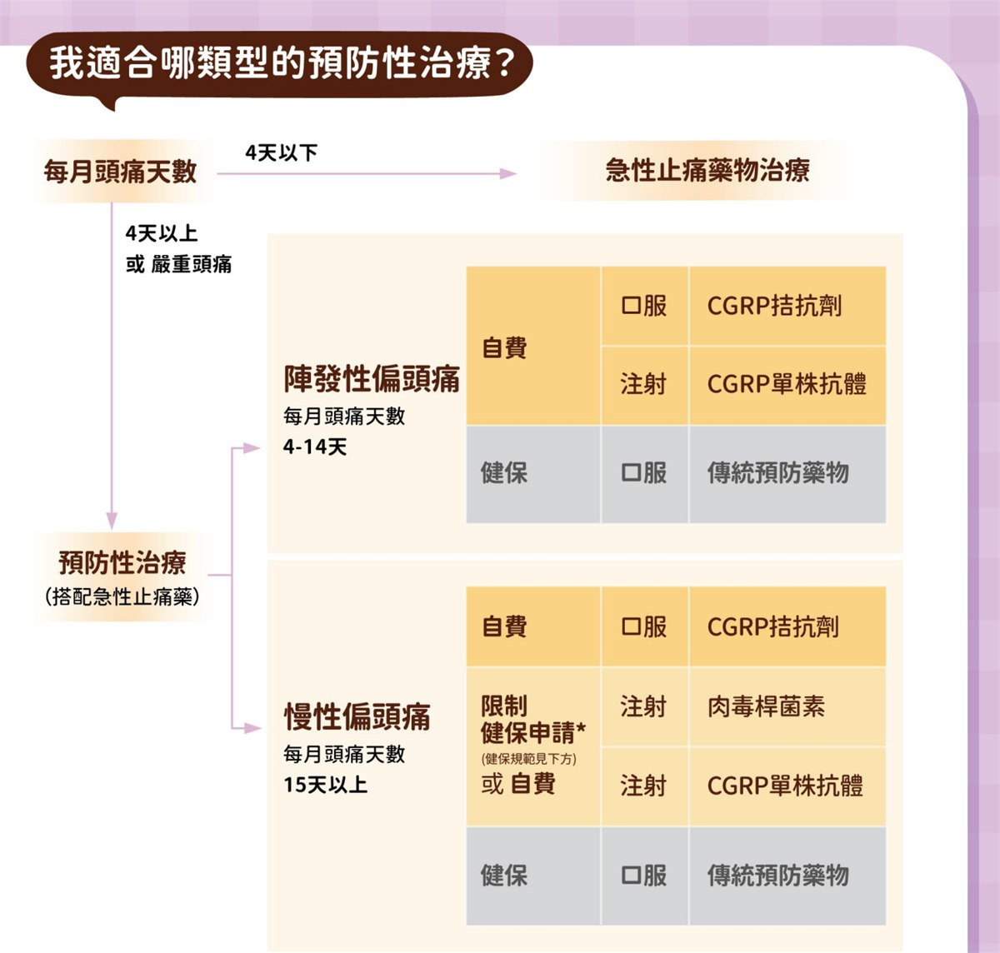

在前篇的[針劑藥物個別探討](/posts/migraine-prevention-injections/)之後，這一篇希望可以給大家實用的選藥建議，以及各種情況的考量與討論，我也整理了常見迷思問答，希望對各位有幫助！

## 自費使用考量－不只是「買藥」，更是「買時間」

若傳統藥物遇到瓶頸，針劑是非常好的頭痛武器，台灣健保需要患者持續寫「[頭痛日記](/posts/headache-visit-questions/#頭痛病友小幫手頭痛日記)」3 個月以上，並證明已嘗試過 3 種不同類型的傳統藥物或是副作用無法忍受，卻依然無效後，才能由神經科醫師送件申請。

這三個多月的「日記等待期」，要一邊與頭痛共處、持續吃藥，也要一邊忠實記錄頭痛日記，雖然傳統藥物有一定療效，但若是偏頭痛嚴重的病友，就算有最強的止痛藥陪伴，每一天仍然過得煎熬，甚至陷入[藥物成癮](/posts/medication-overuse-headache/#甜蜜背後隱藏的危機)的風險！

不願經歷這些漫長過程的病人，可以考慮「**先自費啟動治療**」。那會花多少錢呢？我簡單算給你看（以台灣目前行情估計）：

- **單株抗體針劑**：依據廠牌不同，目前市場平均行情單劑（每月一次）約落在 9,000 至 12,000 元之間。
  - 若比照健保療程，全自費施打半年，藥價約在 $50,000 至 $70,000 之間。
- **肉毒桿菌注射**：依照國際標準注射指引，每三個月施打一次的費用約在 $15,000 至 $20,000 元上下。換算下來，每個月的負擔約為 $5,000 至 $7,000 元。
  - 若比照健保療程，全自費施打一年半，藥價約在 $90,000 至 $120,000 之間。
- 以上都是只計算藥費而已，尚未考慮掛號費、診查費、醫事費等等⋯⋯。
- 以本院來說，自費療程並不需要預先支付往後數個月的療程喔，因此有意願啟動自費治療的病友，可以用單次打針的費用去評估～覺得有效再繼續自費，或者是同時申請健保給付。

▲本段落僅提供目前醫學市場之平均行情參考，實際費用因各醫療機構收費標準、療程規劃及耗材而異，請務必以診間醫師諮詢與醫院公告為準。

選擇自費最大的好處在於：**「買回被頭痛偷走的時間」**。
如果經濟狀況許可，提前啟動精準治療，更有機會讓你盡早恢復社交與工作。此外，在自費治療的過程中的治療反應紀錄，也能作為強而有力的臨床證據。對於未來若要銜接申請健保給付時，能派得上用場。

這筆投資你值得好好考慮。歡迎到診間找醫師討論喔！

## 別急！預防針不是止痛針－「三個月評估期」

無論是單株抗體針劑、還是肉毒桿菌，這類藥物在大多數情況都不是「一針見效」的萬靈丹。就像我之前提過的預防藥心法：[它需要一點時間，畢竟關了火之後，要等待水溫冷卻才行](https://blog.drminyangwu.com/2025/06/migraine-medication-User-guide-prevention.html#point1)，不管是傳統藥或是新藥都一樣。

因此，我會建議病友：無論是自費打針或是有健保給付，請至少給予預防針「三個月」的時間。如果只打一針覺得沒效就停藥，往往無法看到藥物的真正實力，這筆投資反而變得可惜。

當然，回到前面段落提到的，若有效的話，預防針在使用一週～兩週開始有感，相較於傳統藥物的二～四週，還是較有優勢。

## 長效針劑比一比

以上我比較了台灣的偏頭痛預防針劑藥物，也是重點整理，希望對各位有幫助！

另外我再分享台灣兩種單株抗體的差別：

1. **用藥頻率**：兩種藥物都可以每個月施打，但是艾久維 (Ajovy®) 也可以選擇每三個月打一次，一次打三支。使用上彈性更高。
2. **注射感受**：艾久維 (Ajovy®) 在推藥的速度可由施打人員決定；恩疼停 (Emgality®) 為全自動注射針，按下開關後它會 10 秒之內自動將藥物推入。
   - 從推藥速度來看，理論上恩疼停感受會比較痛一些，但不需手動推藥，操作比較方便；打艾久維的時候如果很痛，可以請打針的人推慢一點，但是注射時間會拉長。
3. **適應症差異**：兩者都可用來作為陣發性偏頭痛，與慢性偏頭痛的預防藥物。但是恩疼停 (Emgality®) 多了治療**[叢發性頭痛](/posts/headache-map-part1/#3-叢發性頭痛-cluster-headache)**的功能！
   ▲儘管恩疼停 (Emgality®) 可治療叢發性頭痛，但是台灣健保並未針對此種疾病納入健保，因此若你是叢發性頭痛患者，要施打恩疼停的話，會需要自費！

## 醫病用藥決策：我該選擇哪種針劑藥物？

▲以上截圖自台灣頭痛學會：**[2025 偏頭痛衛教四摺頁](https://taiwanheadache.org.tw/wp-content/uploads/2025/10/2025%E5%81%8F%E9%A0%AD%E7%97%9B%E8%A1%9B%E6%95%99%E5%9B%9B%E6%91%BA%E9%A0%81_%E5%96%AE%E9%A0%81-1.pdf)**

除了參考上面的流程圖、看[針劑比較表格](#長效針劑比一比)之外，我也會從以下幾個切入點評估：

1. **其他共病史**：
   - 對於有心血管疾病史、或是特殊型態偏頭痛患者，**肉毒桿菌**是相對比較安全的選擇。
   - 若你同時罹患有偏頭痛和叢發性頭痛，可選用**恩疼停**，對於這兩種頭痛都能治療。但是治療劑量並不相同！請先諮詢醫師。
2. **特殊族群**：懷孕婦女的話，除了少數幾種傳統口服預防藥之外，肉毒桿菌或許是可以考慮的選擇，但是相關研究不多，需與醫師討論。
3. **用藥便利性**：若想要簡單快速的話，**單株抗體**會更適合。
   - 肉毒桿菌一次施打要 30 多個點、相較之下單株抗體一支就打一個位置就好，比較不花時間。
4. **頭痛日記**：如果你很不愛寫日記，或是不想花太多時間紀錄，**單株抗體**會比較適合你。
   - 首次申請健保都是先寫 3 個月。但是在續用申請時，肉毒桿菌要寫 6 個月、單株抗體寫 3 個月。因此從完整療程來說，肉毒最少要寫 9 個月、單株抗體最少寫 6 個月。
   - 但是有頭痛日記，除了用健保省荷包之外，也方便醫師和病人自己掌握病況，也可作為調藥參考，所以還是呼籲大家耐心記錄～
   - 頭痛日記也有手機 APP，不喜歡手寫的可以考慮，但是送審的時候還是要轉換成紙本資料喔。
5. **回診就醫頻率**：若你工作繁忙請假不易，或是居住於外縣市，不喜歡常跑醫院，三個月打一次的**肉毒桿菌**、或**艾久維**會比較適合。
6. **經濟成本效益**：以 CP 值來說，**肉毒桿菌**會比較划算。
   - 雖然單次注射的價格，肉毒通常略高於單株抗體，但是因為肉毒藥效持續時間較久，需要的療程也較長，因此平均下來每個月的花費比較低。
7. **其他個別考量**：
   - 若你非常怕痛、怕流血、甚至有暈針的情形，可考慮單點注射的**單株抗體**。
   - 除了頭痛，也常伴隨頸部緊繃、肩頸痠痛的病人，可考慮**肉毒桿菌**。
8. 如果偏頭痛相當嚴重頻繁，傳統藥物效果不佳，又不想打針，且經濟寬裕的話，可考慮自費**口服標靶藥物**〔請參照 [Gepant 藥物推薦](https://blog.drminyangwu.com/2024/12/Gepant-atogepant-Qualipta%20vs%20Rimegepant%20-%20Nurtec%20-%20comparison-oral-%20new%20drug%20-%202024%20%20.html#point9)〕。

## 病友迷思破解：門診大哉問

### 1. 打了針之後，就不用吃口服藥了嗎？

- 陣發性偏頭痛治療的反應效果通常較好，因此打了針之後，視頭痛情況與個人意願，與醫師討論是否停藥。
- 慢性偏頭痛由於頻率高，病情較嚴重，一般建議打了針之後，還是繼續吃傳統口服藥一段時間，視頭痛改善情況，再與醫師討論逐步減藥或停藥。
- 根據[國際指引](https://pubmed.ncbi.nlm.nih.gov/39262214/)，有效的預防治療應持續至少六個月（口服藥物）或十二個月（非口服藥物治療），然後才考慮停藥。當然實務上都可以再和醫師討論～

### 2. 打針效果有多好呢？比起吃藥來說？

- 在陣發性偏頭痛族群，單株抗體使用 3 個月之後，約可以有 4~5 成的病人可以減少一半的頭痛頻率。若使用半年，可以提高到將近 6 成！
- 在慢性偏頭痛族群，肉毒桿菌使用 3 個月之後，約可以有 4~5 成的病人可以減少一半的頭痛頻率，若長期施打（>2 年）以上，頭痛仍可有效控制，約三分之二的患者的頭痛頻率可減少一半以上
- 在慢性偏頭痛族群，單株抗體使用 3 個月之後，約可以有 3~4 成多的病人可以減少一半的頭痛頻率。若是使用半年，改善的比例會再更高。

### 3. 小孩子才做選擇，新型藥物我可以全都申請健保嗎？

- 若要申請健保給付之**新型藥物（肉毒桿菌、單株抗體）**，一次僅可挑一種申請，無法同時申請併用。
- 實務作法為：可申請健保給付一種新型藥物，同時自費使用另一種新型藥物。預防效果通常會更好！我有門診患者就是這樣使用。

▲小提醒：**[新型口服標靶藥物](https://blog.drminyangwu.com/2024/10/2024-gepant.html)**，目前為全自費使用，尚未納入健保喔！

### 4. 打肉毒也可用來放鬆肌肉或是止痛嗎？

- 肉毒桿菌素可以阻斷神經與肌肉之間的訊號傳遞，達到肌肉放鬆。因此有舒緩肌肉僵硬和緊繃的效果，因此它能做到放鬆肌肉、除皺、止痛等等。
- 儘管如此，它治療偏頭痛的原理，並非透過單純放鬆肌肉喔，一樣和上述的 CGRP 有關。因此同樣都是打肉毒，在治療偏頭痛的打法與劑量，和醫學美容完全不一樣喔！

### 5. 打肉毒安全嗎？

- 門診也會遇到病人來向我諮詢肉毒的副作用
- 去年 2025 年 4 月份曾有新聞報導，一位中年女性打完肉毒後出現中毒症狀，甚至插管入住加護病房。【請參考以下 Youtube 影片：[4旬女網購美容針竟是肉毒桿菌素 中毒插管入住ICU](https://www.youtube.com/watch?v=WsqXO_ZCm5M)】。
- 若毒素擴散到其他部位，可能會出現眼瞼下垂、複視、嘴角歪斜等症狀。一旦發生口乾、語言障礙、視力模糊、吞嚥困難、呼吸困難、肌肉無力等少見的嚴重不良反應時，應即刻就醫！
- 當然，肉毒桿菌就該由專業[注射認證](https://blog.drminyangwu.com/2024/06/blog-post.html)過的醫師評估施打，將風險最小化！

### 6. 如果第一次先自費打針，之後還能使用健保嗎？

- **理論上是可以的** → 我有門診病人一邊寫頭痛日記，但是因為她不想等，所以她同時也先自費打針。時間到了我一樣替她送申請，後續她有通過審核，於是接下來幾次的療程就健保給付，不用再自費了。
- 當然最終還是要以健保審查委員的看法為主…。
- 此外，審查給付也分為兩階段：首次申請和續用申請。部分患者在首次療程後，若進步幅度有限，可能無法通過續用療程審查。當然會如此規定也算合理，畢竟如果前面打了幾次卻幫助不大，代表它也不適合你。

### 7. 數個月的自費療程，需要一次性付清嗎？

- 以本院來說，自費療程**並不需要預先支付**往後數個月的療程喔，因此有意願啟動自費治療的病友，可以先用單次打針的費用去評估～覺得有效再繼續自費，或者是同時申請健保給付。
- 若打了前幾次自費療程，不幸地都覺得無效，可考慮中斷該針劑藥物使用，再和醫師討論其他治療方案～

### 8. 若我接受了完整的療程之後，偏頭痛就不會再困擾我了嗎？

- 由於偏頭痛是一種慢性疾病，就像高血壓糖尿病那樣，不是發燒感冒，很難做到一勞永逸或是完全治癒，我們的最終目標是讓它穩定不影響生活。
- 療程結束後，確實有可能部分病人會再頭痛回升，因此為了避免此類狀況，日常生活保養（包含[飲食指南](/posts/migraine-diet/)）、門診追蹤都很重要！

### 9. 如果已經打過完整的療程，之後偏頭痛復發怎麼辦？

- 除了上面提到，做好日常保養之外，若你是慢性偏頭痛患者，由於病情較嚴重，一般會建議接受針劑療程時，也要維持一些傳統預防藥物，作為銜接。
- 上一篇的[針劑個論](/posts/migraine-prevention-injections/#一精準打擊cgrp-單株抗體針劑)有提到：在打完健保給付的針劑療程之後，會有**半年內不得再申請**的限制。對於慢性偏頭痛患者來說，由於他們的治療較不易，因此可以在這段 6 個月的空窗期，考慮自費藥物，以維持治療效果，避免療效中斷喔！
- 若頭痛復發，可撰寫頭痛日記，半年之後，可考慮再申請另外一種長效針劑。若有通過的話，便可重啟新的療程。

### 10. 新藥一定比較好嗎？

- 這是很多人都會問的問題！新藥與舊藥之間，就好比是高鐵和客運的關係，各有適合的對象，詳細討論請點閱[貼文連結](https://www.facebook.com/share/p/1Asq9umW5U/)。
- 老話一句，沒有最好的，只有最適合你的藥！

## 結語：主動管理，贏回頭痛自主權

偏頭痛不只是一陣痛，它是一種大腦神經的慢性發炎。從傳統藥物的基石，到現代標靶技術的突破，我們已經擁有比過去更多的武器來對抗它。

如果你已經被偏頭痛纏到懷疑人生，而且吃傳統口服藥沒什麼效果，副作用一堆，歡迎來診間，我們可以一起討論最適合你的預防針治療計畫～

現今偏頭痛治療選項非常多樣，每位病友一定都找的到最順手的武器，打擊偏頭痛！

其他細節，歡迎到診間找醫師討論喔！

## 延伸閱讀

- [頭痛看診前必讀，醫生會問我什麼問題？](/posts/headache-visit-questions/)
- [偏頭痛不是多吃止痛藥就能解決！超過 7 成患者忽略的「關火法」才是關鍵](https://blog.drminyangwu.com/2025/06/migraine-medication-User-guide-prevention.html)
- [市售止痛藥，為何吃越多越沒效？認識藥物過度使用頭痛](/posts/medication-overuse-headache/)
- [偏頭痛「預防藥治療」攻略：傳統口服藥 (一)](/posts/migraine-prevention-oral/)
- [偏頭痛「預防藥治療」攻略：長效針劑 (二)](/posts/migraine-prevention-injections/)
- [瞄準偏頭痛的銀色子彈 –2024 年新型口服藥（Gepant）簡介 (上) — 機轉](https://blog.drminyangwu.com/2024/10/2024-gepant.html)
- [改善偏頭痛，該吃什麼呢？加分飲食 vs 地雷食物清單](/posts/migraine-diet/)

## 參考資料

- [請問偏頭痛預防性注射針劑有哪些？](https://taiwanheadache.org.tw/medication-ins/%e8%ab%8b%e5%95%8f%e5%81%8f%e9%a0%ad%e7%97%9b%e9%a0%90%e9%98%b2%e6%80%a7%e6%b3%a8%e5%b0%84%e9%87%9d%e5%8a%91%e6%9c%89%e5%93%aa%e4%ba%9b%ef%bc%9f/)（台灣頭痛學會）
- 2022 台灣頭痛學會民眾衛教手冊
- [2022 台灣偏頭痛預防性治療準則](https://taiwanheadache.org.tw/wp-content/uploads/2022/10/2022-%E5%81%8F%E9%A0%AD%E7%97%9B%E9%A0%90%E9%98%B2%E6%80%A7%E6%B2%BB%E7%99%82%E6%BA%96%E5%89%87-revised.pdf)
- [International Headache Society Global Practice Recommendations for Preventive Pharmacological Treatment of Migraine](https://pubmed.ncbi.nlm.nih.gov/39262214/)：國際頭痛學會，偏頭痛預防性藥物治療之全球臨床指南建議
- 台灣頭痛學會：[2025 偏頭痛衛教四摺頁](https://taiwanheadache.org.tw/wp-content/uploads/2025/10/2025%E5%81%8F%E9%A0%AD%E7%97%9B%E8%A1%9B%E6%95%99%E5%9B%9B%E6%91%BA%E9%A0%81_%E5%96%AE%E9%A0%81-1.pdf)
- [長安神經醫學中心：偏頭痛、長期頭痛 (CGRP 單株抗體)](http://www.everanhospital.com.tw/neuro/treatment-items/item/260.html)
- [減輕肌肉痙攣的肉毒桿菌注射](https://epaper.ntuh.gov.tw/health/202504/special_1_1.html)（台大醫院健康電子報）
