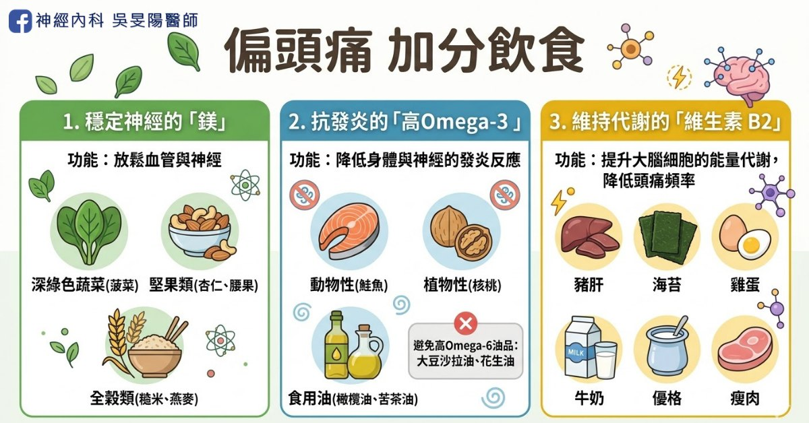
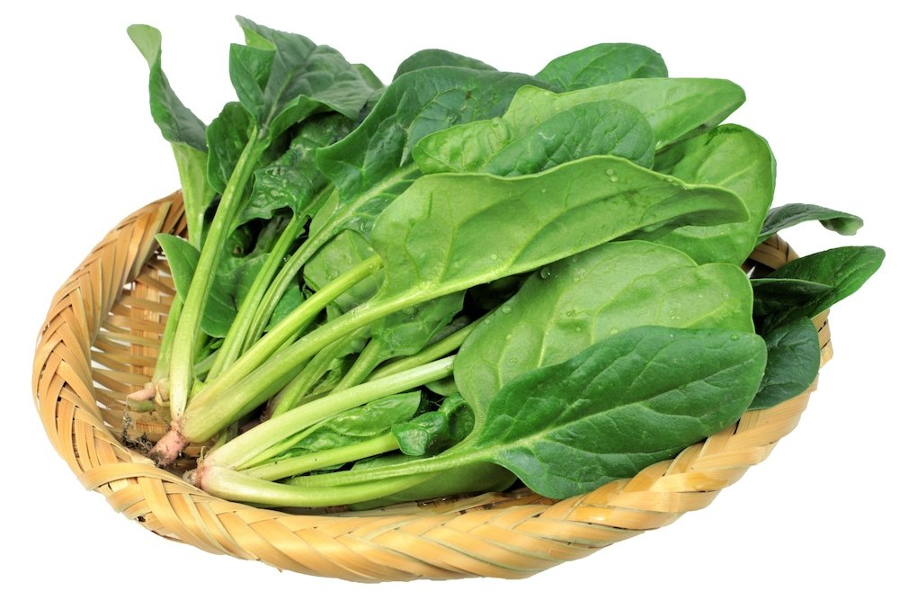
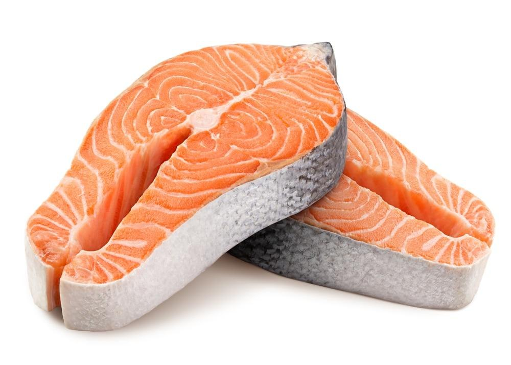
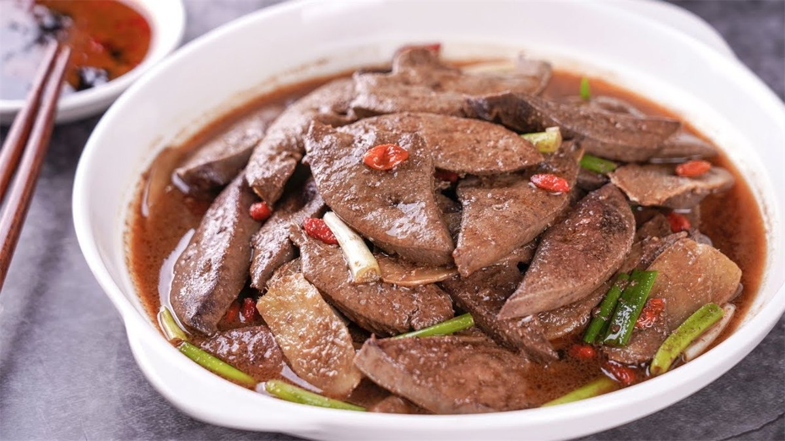
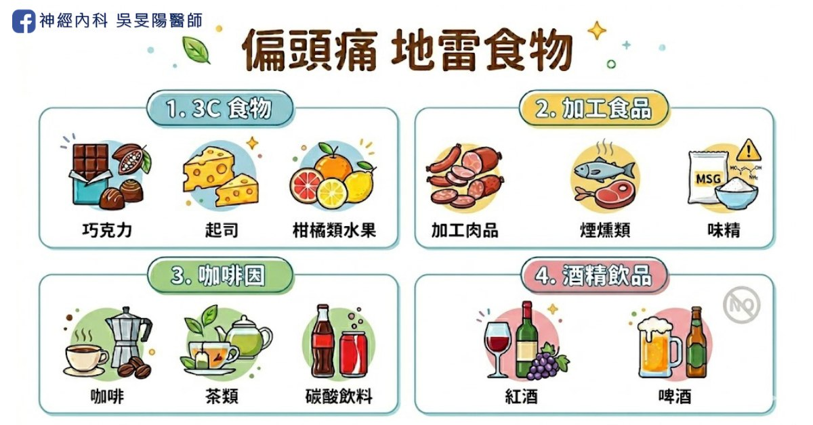
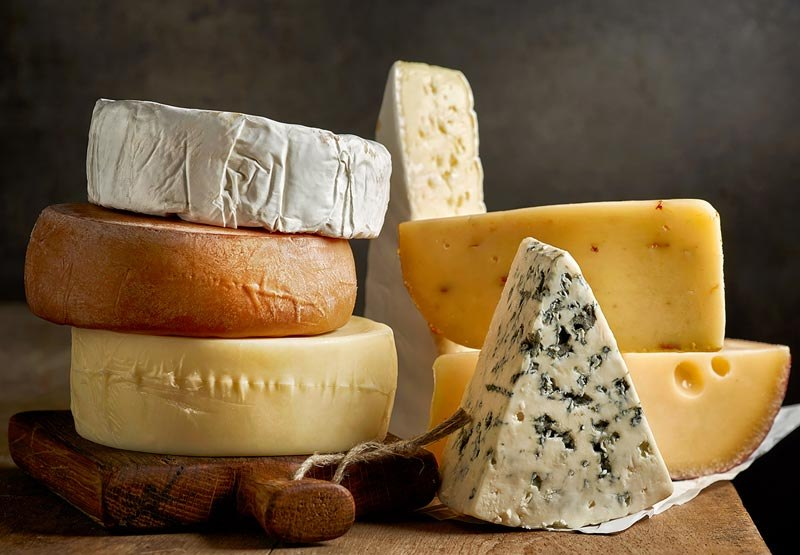
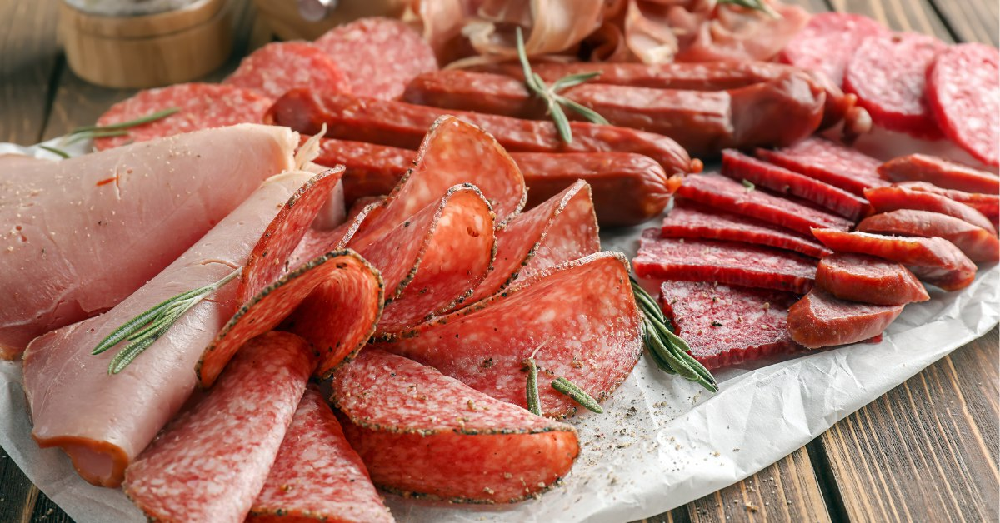
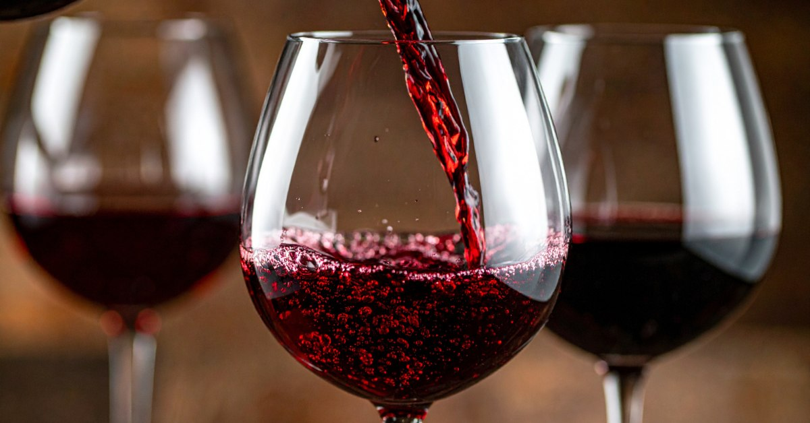
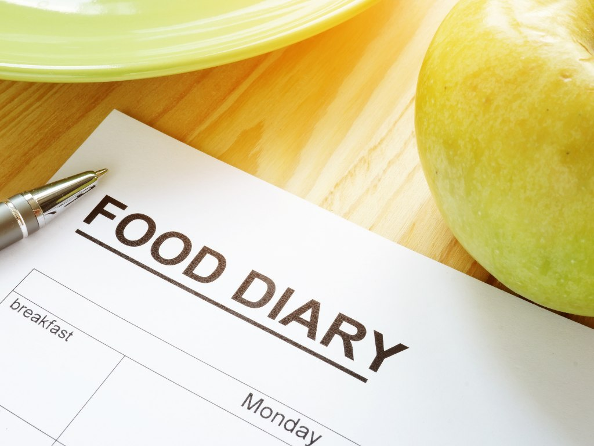

偏頭痛治療，往往需要耐心與時間，除了按時服藥，寫頭痛日記之外，病友也常常提問：

「每天吃鮭魚，就能預防頭痛嗎？」

「不能再喝咖啡、吃巧克力了嗎？」

研究與臨床經驗指出，飲食是偏頭痛患者常見的誘發因素之一。雖然不一定是每個人的主因，但調整飲食習慣，確實是偏頭痛管理中值得注意的一環！這篇一次整理給你。

## 加法飲食│補充適量營養素，改善偏頭痛！



以下 3 種是研究中被認為，對於偏頭痛有幫助的營養素或食物。

### 1. 鎂（Magnesium）



鎂是天然的神經穩定劑，有助穩定神經與血管，美國神經學會之治療指引曾提及，鎂劑對偏頭痛預防有幫助，後續研究也多數顯示有效，常見食物來源有：

- **深綠色蔬菜**：菠菜、地瓜葉、綠花椰菜、青江菜、韭菜
- **堅果類**：杏仁、腰果、核桃、夏威夷豆、開心果、榛果
- **全穀類**：糙米、燕麥、紫米、蕎麥、小米、藜麥

▲如需直接補充鎂，**建議與醫師討論適合自己的劑型**，市面上的鎂補充劑多選用檸檬酸鎂、氧化鎂，常有腹瀉副作用，須留意。

### 2. 高 Omega-3



選擇食用高 Omega-3、低 Omega-6 脂肪酸的食物，具有抗發炎及保護心血管的功效，能減少頭痛頻率，常見食物來源：

- **動物性**：鮭魚、鯖魚、秋刀魚、柳葉魚、大西洋鱈魚、海鱺等深海魚類
- **植物性**：核桃、亞麻籽、奇亞籽（素食者適用）
- **食用油**：橄欖油、苦茶油。

▲避免食用大豆沙拉油、棕櫚油、花生油（皆為高 Omega-6 油）。

### 3. 維生素 B2（核黃素）



核黃素可提升大腦細胞的能量代謝，研究結果顯示，每天食用 400mg 的 B2（核黃素），持續 3 個月可能對改善偏頭痛有效。常見食物來源：

- **肝臟類**：豬肝、雞肝、牛肝
- **植物性**：乾香菇、紫菜、海苔
- **乳製品**：牛奶、優格
- 瘦肉、文蛤、雞蛋（特別是蛋黃）。

▲400mg 為高劑量的特殊補充，**建議與醫師討論用藥**，避免和腎疾病或正服用的藥物產生衝突。

▲市售的維生素 B2 補充錠，高強效約 50~100mg，只能用於一般保健用途。

## 地雷食物│避免 3C 飲食



根據研究統計，有 15% 患者的偏頭痛發作與特定食物有關，除了 3C 食物，加工食品、咖啡因、紅酒和酒精飲品，也常視為頭痛誘發因子。

### 1. 3C 食物



容易誘發偏頭痛的 3 類食物，含有「酪胺酸」，會刺激交感神經，造成血管收縮或痙攣，進而引發劇烈的偏頭痛。

- **巧克力 (Chocolate)**：尤其是純度較高的黑巧克力，含有 β-苯乙胺 (beta-phenylethylamine)，少數人因過度刺激而引發頭痛。
- **起司 (Cheese)**：藍紋起司、莫札瑞拉、帕馬森等起司製品，富含酪胺酸 (Tyramine)，會讓血管擴張收縮，誘發頭痛。
- **柑橘類水果 (Citrus)**：柳丁、橘子、檸檬、葡萄柚。

### 2. 加工食品



加工食品含多種人工添加劑、化學香料或氫化脂肪，是血管擴張的隱形幫兇。

- **加工肉品**：香腸、臘肉、培根、火腿、熱狗，含有為了維持肉色而添加的成分亞硝酸鹽。
- **煙燻類**：煙燻香腸、煙燻鮭魚
- 代糖飲料（零卡可樂、無糖口香糖）、味精

### 3. 咖啡因


成年人建議攝取量 <400 mg/天，攝取過量的咖啡因，會引發心悸、焦慮、失眠或頭痛等不良反應，更有成癮的風險，而部分市售的止痛藥含有咖啡因成分，過度使用會導致吃越多，頭越痛。常見的食物來源：

- **茶類**：紅茶、綠茶、烏龍茶，以及手搖店的奶茶、抹茶。
- **碳酸與機能飲料**：可樂、Redbull、紅牛、魔爪等提神能量飲料。
- **咖啡製品**：咖啡凍、提拉米蘇、咖啡口味的餅乾或糖果。

```chart
title: 一天的咖啡因，很容易不知不覺就超標
unit:  mg
max: 440
每日建議上限 | 400
EVE 止痛藥一次 2 顆、一天 3 次 | 240
再加一杯中杯美式 | 440
```

▲市售的 EVE 止痛藥含有咖啡因，成年人一次 2 顆（80mg）× 3 餐 = 240mg，如再喝一杯中杯美式（200mg），即超過每日建議攝取量！

▲有喝咖啡提神習慣的人，建議可固定時間、固定份量（早上 1 杯/天），不須立刻戒掉，適量咖啡因是沒問題的。

**延伸閱讀**：[市售止痛藥，為何吃越多越沒效？認識藥物過度使用頭痛](/posts/medication-overuse-headache/)

### 4. 酒精飲品



紅酒中的組織胺、單寧等成分，與部分患者的頭痛發作有關，各類酒精也會擴張腦部血管，除了引起宿醉，也易誘發頭痛。

## 飲食日記│幫你找出頭痛原因的好幫手



飲食日記，是找出誘發頭痛關鍵的有效方法。透過連續紀錄 2～4 週，可協助你釐清個人的地雷食物，同時避免因過度盲目忌口，而產生心理壓力。使用手機備忘錄或紙本，每次發作時記錄以下 5 項具體內容：

1. **頭痛時間與嚴重度**：頭痛開始與結束的時間，疼痛指數（1-10 分）。
2. **發作前飲食**：發作前 24 小時內吃過的食物與飲品，包含零食、咖啡因、水分與點心。
3. **睡眠與壓力**：前晚的睡眠品質、時數，以及當天是否有壓力事件。
4. **其他觸發點**：記錄當天的天氣變化、是否長時間空腹。
5. **緩解方式**：服用何種藥物、休息多久後才獲得改善。

▲女性可增加紀錄月經週期。

▲飲食日記，部分與[頭痛日記](/posts/headache-visit-questions/#頭痛病友小幫手頭痛日記)重疊，可合併一同紀錄。

## 飲食調整│絕對無法取代正規治療

盤點以上，會發現誘發頭痛的地雷食物還不少。飲食調整算是輔助，不能取代正規治療，如果頭痛嚴重或是頻繁發作，仍建議就醫，與醫師討論更關鍵的[預防性藥物治療](/posts/migraine-prevention-oral/)，配合規律運動，與調整生活作息。

文章中所列出的地雷食物，儘管有參考價值，但不代表「吃了都一定會頭痛」，千萬別把這些食物想成毒藥。

雖然偏頭痛和飲食有關連，但因人而異，任何誘發因子，如睡眠不足、壓力、荷爾蒙變化、天氣或飢餓都有可能，畢竟飲食是人生樂趣之一，我不希望因為看了本篇文章，就禁吃可疑食物，這樣生活也太辛苦！

## 飲食原則│三餐正常吃，比吃什麼還重要！

除了吃什麼食物外，偏頭痛患者更要留意「是否三餐正常吃」。任何不規律的進食，如空腹、延遲用餐、血糖波動，對部分患者來說，比特定食物更容易誘發頭痛。

有些人以為自己是喝咖啡而頭痛，但仔細回想才發現，當天從早忙到晚，只喝一杯咖啡，午餐也沒吃。這時候，真正的兇手不是那杯咖啡，而是「太久沒進食」。

> 偏頭痛患者宜規律飲食，避免因空腹太久，導致**飢餓性頭痛**，更可考慮以較小份量、較規律的方式進食（參考自 [American Migraine Foundation](https://americanmigrainefoundation.org/resource-library/diet-and-migraine/)）

## 偏頭痛飲食的 3 大重點

### 一、加分飲食不能替代治療，地雷食物因人而異

有助於改善頭痛的食物，只能當作加分飲食，無法取代正規治療，而個人對於食物的反應不同，因此不是每個地雷食物，都需全部禁止

### 二、善用飲食日記，協助找出原因

如果嚴格控管飲食，人生可能會瞬間少掉一半樂趣，造成壓力，從而加劇疼痛症狀，因此，建議先使用飲食日記，找出個人地雷食物喔！

### 三、規律飲食最重要

規律時間進食用餐，不要跳餐、空腹太久或嚴格忌口。

▲頭痛頻率過高、止痛藥越吃越多，甚至影響生活品質，歡迎到神經內科門診評估治療！

## 延伸閱讀

頭痛入門必讀

- [頭痛看診前必讀，醫生會問我什麼問題？](/posts/headache-visit-questions/)
- [10 大危險頭痛警訊！哪些情況需要看醫生，一次告訴你](/posts/headache-red-flags/)

頭痛地圖：痛哪裡找哪裡

- [太陽穴兩邊隱隱作痛？6 大頭痛位置、可能病因、常見 3 個原發性頭痛一次看：頭痛地圖指南(上)](/posts/headache-map-part1/)
- [當心致命「次發性頭痛」！ 一文看懂 7 個次發性頭痛原因、症狀、位置：頭痛地圖指南(下)](/posts/headache-map-part2/)

偏頭痛病友請進

- [市售止痛藥，為何吃越多越沒效？認識藥物過度使用頭痛](/posts/medication-overuse-headache/)
- [爆炸型頭痛的隱形殺手 – 小心「可逆性腦血管收縮症候群」！](https://blog.drminyangwu.com/2025/05/thunderclap-headache-Reversible-Cerebral-Vasoconstriction-Syndrome%20%20.html)
- [吃冰會頭痛，也是一種病 – 什麼是「冰淇淋頭痛」？](https://blog.drminyangwu.com/2025/11/headachecold-stimulus-headache-brain-freeze-ice-cream.html)

## 參考資料

- 2022 台灣頭痛學會民眾衛教手冊
- [2022 台灣偏頭痛預防性治療準則](https://taiwanheadache.org.tw/wp-content/uploads/2022/10/2022-%E5%81%8F%E9%A0%AD%E7%97%9B%E9%A0%90%E9%98%B2%E6%80%A7%E6%B2%BB%E7%99%82%E6%BA%96%E5%89%87-revised.pdf)
- [請問偏頭痛的輔助與替代療法有哪些？](https://taiwanheadache.org.tw/headache-treatment/%E8%AB%8B%E5%95%8F%E5%81%8F%E9%A0%AD%E7%97%9B%E7%9A%84%E8%BD%89%E5%8A%A9%E8%88%87%E6%9B%BF%E4%BB%A3%E7%99%82%E6%B3%95%E6%9C%89%E5%93%AA%E4%BA%9B%EF%BC%9F/)
